# Private Law State Model

Generated from commit [`3c6896516b099c840e1f7a07828e44628ab5f1a6`](https://github.com/hmcts/prl-ccd-definitions/tree/3c6896516b099c840e1f7a07828e44628ab5f1a6)  
Commit date: `3 June 2026 at 14:40`

## Lifecycle state changes

```mermaid
stateDiagram-v2
    state "Start" as __START__
    ALL_FINAL_ORDERS_ISSUED --> CASE_ISSUED : Add case number, Reopen closed cases
    ALL_FINAL_ORDERS_ISSUED --> PREPARE_FOR_HEARING_CONDUCT_HEARING : Reopen closed cases
    ALL_FINAL_ORDERS_ISSUED --> SUBMITTED_PAID : Process urgent help with fees
    AWAITING_INFORMATION --> ALL_FINAL_ORDERS_ISSUED : Manage orders, Record final decision, Create/upload draft order<br/>Edit and serve an order, Edit and serve an order
    AWAITING_INFORMATION --> AWAITING_RESUBMISSION_TO_HMCTS : Return application
    AWAITING_INFORMATION --> CASE_ISSUED : Issue and send to local court, Add case number
    AWAITING_INFORMATION --> JUDICIAL_REVIEW : Send to gatekeeper, Send to gatekeeper
    AWAITING_INFORMATION --> PREPARE_FOR_HEARING_CONDUCT_HEARING : Service of application
    AWAITING_INFORMATION --> PROCEEDS_IN_HERITAGE_SYSTEM : Issue and send to local court
    AWAITING_INFORMATION --> SUBMITTED_PAID : Process HWF for Citizen case, Process urgent help with fees
    AWAITING_RESUBMISSION_TO_HMCTS --> ALL_FINAL_ORDERS_ISSUED : Record final decision, Create/upload draft order, Edit and serve an order<br/>Edit and serve an order
    AWAITING_RESUBMISSION_TO_HMCTS --> AWAITING_SUBMISSION_TO_HMCTS : Safeguarding and risk of harm
    AWAITING_RESUBMISSION_TO_HMCTS --> CASE_ISSUED : Add case number
    AWAITING_RESUBMISSION_TO_HMCTS --> CASE_WITHDRAWN : Withdraw application
    AWAITING_RESUBMISSION_TO_HMCTS --> SUBMITTED_PAID : Process urgent help with fees
    AWAITING_SUBMISSION_TO_HMCTS --> ALL_FINAL_ORDERS_ISSUED : Create/upload draft order
    AWAITING_SUBMISSION_TO_HMCTS --> CASE_WITHDRAWN : Withdraw application
    AWAITING_SUBMISSION_TO_HMCTS --> PROCEEDS_IN_HERITAGE_SYSTEM : Statement of Truth and submit
    AWAITING_SUBMISSION_TO_HMCTS --> READY_FOR_DELETION : Delete application
    AWAITING_SUBMISSION_TO_HMCTS --> SUBMITTED_NOT_PAID : Submit and pay, Submit Citizen Case with HWF
    AWAITING_SUBMISSION_TO_HMCTS --> SUBMITTED_PAID : Statement of Truth and submit, Submit Citizen Case
    Any --> DECISION_OUTCOME : Decision Outcome
    Any --> PREPARE_FOR_HEARING_CONDUCT_HEARING : Confidentiality check
    Any --> SUBMITTED_PAID : Payment confirmation
    CASE_ISSUED --> ALL_FINAL_ORDERS_ISSUED : Manage orders, Manage orders, Record final decision, Create/upload draft order<br/>Edit and serve an order, Edit and serve an order
    CASE_ISSUED --> AWAITING_INFORMATION : Request Further Information, Further Information Reasons
    CASE_ISSUED --> AWAITING_RESUBMISSION_TO_HMCTS : Return application
    CASE_ISSUED --> JUDICIAL_REVIEW : Send to gatekeeper, Send to gatekeeper
    CASE_ISSUED --> SUBMITTED_PAID : Process urgent help with fees
    CASE_WITHDRAWN --> ALL_FINAL_ORDERS_ISSUED : Manage orders, Manage orders, Create/upload draft order
    CASE_WITHDRAWN --> SUBMITTED_PAID : Process urgent help with fees
    DECISION_OUTCOME --> ALL_FINAL_ORDERS_ISSUED : Manage orders, Manage orders, Record final decision, Create/upload draft order<br/>Edit and serve an order, Edit and serve an order
    DECISION_OUTCOME --> CASE_ISSUED : Add case number
    DECISION_OUTCOME --> PREPARE_FOR_HEARING_CONDUCT_HEARING : Return to previous state
    DECISION_OUTCOME --> SUBMITTED_PAID : Process urgent help with fees
    JUDICIAL_REVIEW --> ALL_FINAL_ORDERS_ISSUED : Manage orders, Manage orders, Record final decision, Create/upload draft order<br/>Edit and serve an order, Edit and serve an order
    JUDICIAL_REVIEW --> AWAITING_INFORMATION : Request Further Information, Further Information Reasons
    JUDICIAL_REVIEW --> AWAITING_RESUBMISSION_TO_HMCTS : Return application
    JUDICIAL_REVIEW --> CASE_ISSUED : Add case number
    JUDICIAL_REVIEW --> PREPARE_FOR_HEARING_CONDUCT_HEARING : Service of application
    JUDICIAL_REVIEW --> SUBMITTED_PAID : Process urgent help with fees
    PREPARE_FOR_HEARING_CONDUCT_HEARING --> ALL_FINAL_ORDERS_ISSUED : Manage orders, Manage orders, Record final decision, Create/upload draft order<br/>Edit and serve an order, Edit and serve an order
    PREPARE_FOR_HEARING_CONDUCT_HEARING --> CASE_ISSUED : Add case number
    PREPARE_FOR_HEARING_CONDUCT_HEARING --> SUBMITTED_PAID : Process urgent help with fees
    SUBMITTED_NOT_PAID --> AWAITING_INFORMATION : Request Further Information, Further Information Reasons
    SUBMITTED_NOT_PAID --> CASE_WITHDRAWN : Withdraw application, Withdraw Citizen Case
    SUBMITTED_NOT_PAID --> SUBMITTED_PAID : Process HWF for Citizen case, Process urgent help with fees
    SUBMITTED_PAID --> ALL_FINAL_ORDERS_ISSUED : Record final decision, Create/upload draft order
    SUBMITTED_PAID --> AWAITING_INFORMATION : Request Further Information, Further Information Reasons
    SUBMITTED_PAID --> AWAITING_RESUBMISSION_TO_HMCTS : Return application
    SUBMITTED_PAID --> CASE_ISSUED : Issue and send to local court, Add case number
    SUBMITTED_PAID --> CASE_WITHDRAWN : Withdraw application, Withdraw Citizen Case
    SUBMITTED_PAID --> JUDICIAL_REVIEW : Send to gatekeeper
    SUBMITTED_PAID --> PROCEEDS_IN_HERITAGE_SYSTEM : Issue and send to local court
    __START__ --> AWAITING_SUBMISSION_TO_HMCTS : Solicitor application, Citizen Create Case, Court admin application
    __START__ --> SUBMITTED_PAID : Case created by courtnav
```

## States

| State | Incoming | Outgoing | In-state |
|---|---:|---:|---:|
| [Draft](./states/draft.md) | 4 | 7 | 33 |
| [Submitted](./states/submitted.md) | 6 | 10 | 47 |
| [Pending](./states/pending.md) | 2 | 6 | 2 |
| [Case Issued](./states/case-issued.md) | 3 | 12 | 60 |
| [Returned](./states/returned.md) | 1 | 8 | 51 |
| [Withdrawn](./states/withdrawn.md) | 2 | 4 | 15 |
| [Gatekeeping](./states/gatekeeping.md) | 2 | 12 | 67 |
| [Closed](./states/closed.md) | 6 | 3 | 58 |
| [Hearing](./states/hearing.md) | 4 | 8 | 67 |
| [Hearing Outcome](./states/hearing-outcome.md) | 1 | 9 | 63 |
| [Ready for deletion](./states/ready-for-deletion.md) | 1 | 0 | 0 |
| [Proceeding in offline mode in familyman system](./states/proceeding-in-offline-mode-in-familyman-system.md) | 2 | 0 | 0 |
| [Awaiting Information](./states/awaiting-information.md) | 2 | 13 | 46 |
| [Any state](./states/any-state.md) | — | — | 129 |

