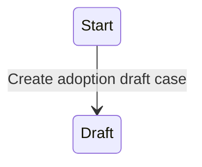

# Adoption State Model

Generated from commit [`f580a2fe927e636cddad323f59c32df41c7b048b`](https://github.com/hmcts/adoption-cos-api/tree/f580a2fe927e636cddad323f59c32df41c7b048b)  
Commit date: `26 May 2026 at 14:00`

## Lifecycle state changes

## States

| State | Incoming | Outgoing | In-state |
|---|---:|---:|---:|
| [Draft](./states/draft.md) | 1 | 0 | 3 |
| [Application awaiting payment](./states/application-awaiting-payment.md) | 0 | 0 | 4 |
| [Submitted](./states/submitted.md) | 0 | 0 | 4 |
| [LA Submitted](./states/la-submitted.md) | 0 | 0 | 15 |
| [Any state](./states/any-state.md) | — | — | 1 |

## Events hidden by sentinel conditions

These events have an enabling condition containing `DO_NOT_SHOW` or `NEVER_SHOW`.

| Event | Pre-state | Post-state | Runnable by | Enabling condition |
|---|---|---|---|---|
| Add a case note (`caseworker-add-casenote`) | `LaSubmitted` | `LaSubmitted` | `caseworker-adoption-caseworker` `caseworker-adoption-judge` | `applicant1Email="DO_NOT_SHOW"` |
| Allocate judge (`caseworker-allocate-judge`) | `LaSubmitted` | `LaSubmitted` | `caseworker-adoption-caseworker` `caseworker-adoption-judge` | `applicant1Email="DO_NOT_SHOW"` |
| Amend applicant details (`caseworker-amend-applicant`) | `LaSubmitted` | `LaSubmitted` | `caseworker-adoption-caseworker` `caseworker-adoption-judge` | `applicant1Email="DO_NOT_SHOW"` |
| Amend case details (`caseworker-amend-case`) | `LaSubmitted` | `LaSubmitted` | `caseworker-adoption-caseworker` `caseworker-adoption-judge` | `applicant1Email="DO_NOT_SHOW"` |
| Amend other parties details (`caseworker-amend-other-parties-details`) | `LaSubmitted` | `LaSubmitted` | `caseworker-adoption-caseworker` `caseworker-adoption-judge` | `applicant1Email="DO_NOT_SHOW"` |
| Check and send orders (`caseworker-check-and-send-orders`) | `LaSubmitted` | `LaSubmitted` | `caseworker-adoption-caseworker` `caseworker-adoption-judge` | `applicant1Email="DO_NOT_SHOW"` |
| Manage documents (`caseworker-manage-document`) | `LaSubmitted` | `LaSubmitted` | `caseworker-adoption-caseworker` `caseworker-adoption-judge` | `applicant1Email="DO_NOT_SHOW"` |
| Manage hearings (`caseworker-manage-hearing`) | `LaSubmitted` | `LaSubmitted` | `caseworker-adoption-caseworker` `caseworker-adoption-judge` | `applicant1Email="DO_NOT_SHOW"` |
| Manage orders (`caseworker-manage-orders`) | `LaSubmitted` | `LaSubmitted` | `caseworker-adoption-caseworker` `caseworker-adoption-judge` | `applicant1Email="DO_NOT_SHOW"` |
| Request Annex-A (`caseworker-request-annex-a`) | `LaSubmitted` | `LaSubmitted` | `caseworker-adoption-caseworker` `caseworker-adoption-judge` | `applicant1Email="DO_NOT_SHOW"` |
| Review all documents (`caseworker-review-document`) | `LaSubmitted` | `LaSubmitted` | `caseworker-adoption-caseworker` | `applicant1Email="DO_NOT_SHOW"` |
| Seek further information (`caseworker-seekfurther-information`) | `LaSubmitted` | `LaSubmitted` | `caseworker-adoption-caseworker` `caseworker-adoption-judge` | `applicant1Email="DO_NOT_SHOW"` |
| Send or reply to messages (`caseworker-send-or-reply`) | `LaSubmitted` | `LaSubmitted` | `caseworker-adoption-caseworker` `caseworker-adoption-judge` | `applicant1Email="DO_NOT_SHOW"` |
| Transfer Court (`caseworker-tranfer-court`) | `LaSubmitted` | `LaSubmitted` | `caseworker-adoption-caseworker` `caseworker-adoption-judge` | `applicant1Email="DO_NOT_SHOW"` |
| Adoption case (`caseworker-update-dss-application`) | `Submitted` | `Submitted` | `caseworker-adoption-systemupdate` | `applicant1Email="DO_NOT_SHOW"` |

## Event inventory

| Event | Pre-state | Post-state | Runnable by | Read-only by | Enabling condition |
|---|---|---|---|---|---|
| Add a case note (`caseworker-add-casenote`) | `LaSubmitted` | `LaSubmitted` | `caseworker-adoption-caseworker` `caseworker-adoption-judge` | — | `applicant1Email="DO_NOT_SHOW"` |
| Allocate judge (`caseworker-allocate-judge`) | `LaSubmitted` | `LaSubmitted` | `caseworker-adoption-caseworker` `caseworker-adoption-judge` | — | `applicant1Email="DO_NOT_SHOW"` |
| Amend applicant details (`caseworker-amend-applicant`) | `LaSubmitted` | `LaSubmitted` | `caseworker-adoption-caseworker` `caseworker-adoption-judge` | — | `applicant1Email="DO_NOT_SHOW"` |
| Amend case details (`caseworker-amend-case`) | `LaSubmitted` | `LaSubmitted` | `caseworker-adoption-caseworker` `caseworker-adoption-judge` | — | `applicant1Email="DO_NOT_SHOW"` |
| Amend other parties details (`caseworker-amend-other-parties-details`) | `LaSubmitted` | `LaSubmitted` | `caseworker-adoption-caseworker` `caseworker-adoption-judge` | — | `applicant1Email="DO_NOT_SHOW"` |
| Check and send orders (`caseworker-check-and-send-orders`) | `LaSubmitted` | `LaSubmitted` | `caseworker-adoption-caseworker` `caseworker-adoption-judge` | — | `applicant1Email="DO_NOT_SHOW"` |
| Manage documents (`caseworker-manage-document`) | `LaSubmitted` | `LaSubmitted` | `caseworker-adoption-caseworker` `caseworker-adoption-judge` | — | `applicant1Email="DO_NOT_SHOW"` |
| Manage hearings (`caseworker-manage-hearing`) | `LaSubmitted` | `LaSubmitted` | `caseworker-adoption-caseworker` `caseworker-adoption-judge` | — | `applicant1Email="DO_NOT_SHOW"` |
| Manage orders (`caseworker-manage-orders`) | `LaSubmitted` | `LaSubmitted` | `caseworker-adoption-caseworker` `caseworker-adoption-judge` | — | `applicant1Email="DO_NOT_SHOW"` |
| Request Annex-A (`caseworker-request-annex-a`) | `LaSubmitted` | `LaSubmitted` | `caseworker-adoption-caseworker` `caseworker-adoption-judge` | — | `applicant1Email="DO_NOT_SHOW"` |
| Review all documents (`caseworker-review-document`) | `LaSubmitted` | `LaSubmitted` | `caseworker-adoption-caseworker` | — | `applicant1Email="DO_NOT_SHOW"` |
| Seek further information (`caseworker-seekfurther-information`) | `LaSubmitted` | `LaSubmitted` | `caseworker-adoption-caseworker` `caseworker-adoption-judge` | — | `applicant1Email="DO_NOT_SHOW"` |
| Send or reply to messages (`caseworker-send-or-reply`) | `LaSubmitted` | `LaSubmitted` | `caseworker-adoption-caseworker` `caseworker-adoption-judge` | — | `applicant1Email="DO_NOT_SHOW"` |
| Transfer Court (`caseworker-tranfer-court`) | `LaSubmitted` | `LaSubmitted` | `caseworker-adoption-caseworker` `caseworker-adoption-judge` | — | `applicant1Email="DO_NOT_SHOW"` |
| Adoption case (`caseworker-update-dss-application`) | `Submitted` | `Submitted` | `caseworker-adoption-systemupdate` | `caseworker-adoption-superuser` | `applicant1Email="DO_NOT_SHOW"` |
| Payment made (`citizen-add-payment`) | `AwaitingPayment` | `AwaitingPayment` | `citizen` | `caseworker-adoption-caseworker` `caseworker-adoption-superuser` | — |
| Create adoption draft case (`citizen-create-application`) | `__START__` | `Draft` | `citizen` | — | — |
| Applicant Statement of Truth (`citizen-submit-application`) | `AwaitingPayment`, `Draft` | `*` | `citizen` | `caseworker-adoption-superuser` | — |
| Adoption case (`citizen-update-application`) | `AwaitingPayment`, `Draft` | `*` | `[CREATOR]` `citizen` | — | — |
| Local Authority Submit (`local-authority-application-submit`) | `Submitted` | `Submitted` | `caseworker-adoption-systemupdate` | `caseworker-adoption-caseworker` `caseworker-adoption-superuser` | — |
| Manage Case TTL (`manageCaseTTL`) | `AwaitingPayment`, `LaSubmitted`, `Submitted` | `*` | `TTL_profile` | — | — |
| Migrate case (`migrate-case`) | `*` | `*` | `caseworker-adoption-systemupdate` | — | — |
| Adoption case (`system-user-update-application`) | `Draft`, `Submitted` | `*` | `caseworker-adoption-systemupdate` | `caseworker-adoption-superuser` | — |

