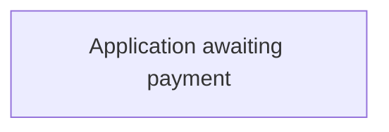

# Application awaiting payment

[Back to Adoption State Model](../index.md)

State ID: `AwaitingPayment`

## Local state model

## Outgoing events

_No events found._

## In-state events

| Event | End state | Runnable by | Enabling condition |
|---|---|---|---|
| Payment made (`citizen-add-payment`) | [Application awaiting payment](./application-awaiting-payment.md) | `citizen` | — |
| Applicant Statement of Truth (`citizen-submit-application`) | [Application awaiting payment](./application-awaiting-payment.md) | `citizen` | — |
| Adoption case (`citizen-update-application`) | [Application awaiting payment](./application-awaiting-payment.md) | `[CREATOR]` `citizen` | — |
| Manage Case TTL (`manageCaseTTL`) | [Application awaiting payment](./application-awaiting-payment.md) | `TTL_profile` | — |

## Incoming events

_No events found._
