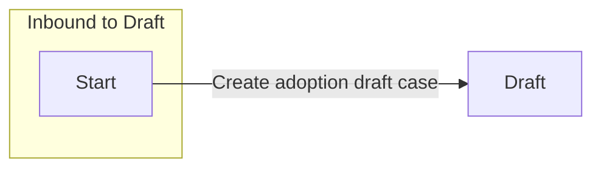

# Draft

[Back to Adoption State Model](../index.md)

State ID: `Draft`

## Local state model

## Outgoing events

_No events found._

## In-state events

| Event | End state | Runnable by | Enabling condition |
|---|---|---|---|
| Applicant Statement of Truth (`citizen-submit-application`) | [Draft](./draft.md) | `citizen` | — |
| Adoption case (`citizen-update-application`) | [Draft](./draft.md) | `[CREATOR]` `citizen` | — |
| Adoption case (`system-user-update-application`) | [Draft](./draft.md) | `caseworker-adoption-systemupdate` | — |

## Incoming events

| Event | Start state | Runnable by | Enabling condition |
|---|---|---|---|
| Create adoption draft case (`citizen-create-application`) | `__START__` | `citizen` | — |
