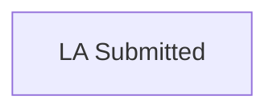

# LA Submitted

[Back to Adoption State Model](../index.md)

State ID: `LaSubmitted`

## Local state model

## Outgoing events

_No events found._

## In-state events

| Event | End state | Runnable by | Enabling condition |
|---|---|---|---|
| Add a case note (`caseworker-add-casenote`) | [LA Submitted](./la-submitted.md) | `caseworker-adoption-caseworker` `caseworker-adoption-judge` | `applicant1Email="DO_NOT_SHOW"` |
| Allocate judge (`caseworker-allocate-judge`) | [LA Submitted](./la-submitted.md) | `caseworker-adoption-caseworker` `caseworker-adoption-judge` | `applicant1Email="DO_NOT_SHOW"` |
| Amend applicant details (`caseworker-amend-applicant`) | [LA Submitted](./la-submitted.md) | `caseworker-adoption-caseworker` `caseworker-adoption-judge` | `applicant1Email="DO_NOT_SHOW"` |
| Amend case details (`caseworker-amend-case`) | [LA Submitted](./la-submitted.md) | `caseworker-adoption-caseworker` `caseworker-adoption-judge` | `applicant1Email="DO_NOT_SHOW"` |
| Amend other parties details (`caseworker-amend-other-parties-details`) | [LA Submitted](./la-submitted.md) | `caseworker-adoption-caseworker` `caseworker-adoption-judge` | `applicant1Email="DO_NOT_SHOW"` |
| Check and send orders (`caseworker-check-and-send-orders`) | [LA Submitted](./la-submitted.md) | `caseworker-adoption-caseworker` `caseworker-adoption-judge` | `applicant1Email="DO_NOT_SHOW"` |
| Manage documents (`caseworker-manage-document`) | [LA Submitted](./la-submitted.md) | `caseworker-adoption-caseworker` `caseworker-adoption-judge` | `applicant1Email="DO_NOT_SHOW"` |
| Manage hearings (`caseworker-manage-hearing`) | [LA Submitted](./la-submitted.md) | `caseworker-adoption-caseworker` `caseworker-adoption-judge` | `applicant1Email="DO_NOT_SHOW"` |
| Manage orders (`caseworker-manage-orders`) | [LA Submitted](./la-submitted.md) | `caseworker-adoption-caseworker` `caseworker-adoption-judge` | `applicant1Email="DO_NOT_SHOW"` |
| Request Annex-A (`caseworker-request-annex-a`) | [LA Submitted](./la-submitted.md) | `caseworker-adoption-caseworker` `caseworker-adoption-judge` | `applicant1Email="DO_NOT_SHOW"` |
| Review all documents (`caseworker-review-document`) | [LA Submitted](./la-submitted.md) | `caseworker-adoption-caseworker` | `applicant1Email="DO_NOT_SHOW"` |
| Seek further information (`caseworker-seekfurther-information`) | [LA Submitted](./la-submitted.md) | `caseworker-adoption-caseworker` `caseworker-adoption-judge` | `applicant1Email="DO_NOT_SHOW"` |
| Send or reply to messages (`caseworker-send-or-reply`) | [LA Submitted](./la-submitted.md) | `caseworker-adoption-caseworker` `caseworker-adoption-judge` | `applicant1Email="DO_NOT_SHOW"` |
| Transfer Court (`caseworker-tranfer-court`) | [LA Submitted](./la-submitted.md) | `caseworker-adoption-caseworker` `caseworker-adoption-judge` | `applicant1Email="DO_NOT_SHOW"` |
| Manage Case TTL (`manageCaseTTL`) | [LA Submitted](./la-submitted.md) | `TTL_profile` | — |

## Incoming events

_No events found._
