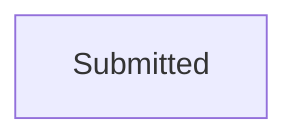

# Submitted

[Back to Adoption State Model](../index.md)

State ID: `Submitted`

## Local state model

## Outgoing events

_No events found._

## In-state events

| Event | End state | Runnable by | Enabling condition |
|---|---|---|---|
| Adoption case (`caseworker-update-dss-application`) | [Submitted](./submitted.md) | `caseworker-adoption-systemupdate` | `applicant1Email="DO_NOT_SHOW"` |
| Local Authority Submit (`local-authority-application-submit`) | [Submitted](./submitted.md) | `caseworker-adoption-systemupdate` | — |
| Manage Case TTL (`manageCaseTTL`) | [Submitted](./submitted.md) | `TTL_profile` | — |
| Adoption case (`system-user-update-application`) | [Submitted](./submitted.md) | `caseworker-adoption-systemupdate` | — |

## Incoming events

_No events found._
