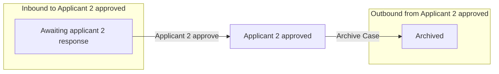

# Applicant 2 approved

[Back to No Fault Divorce State Model](../index.md)

State ID: `Applicant2Approved`

## Local state model

## Outgoing events

| Event | End state | Runnable by | Enabling condition |
|---|---|---|---|
| Archive Case (`solicitor-archive-case`) | [Archived](./archived.md) | `[APPONESOLICITOR]` | — |

## In-state events

| Event | End state | Runnable by | Enabling condition |
|---|---|---|---|
| View applicant contact info (`app1-solicitor-view-app1-contact-info`) | [Applicant 2 approved](./applicant-2-approved.md) | `[APPONESOLICITOR]` | — |
| View respondent contact info (`app1-solicitor-view-app2-contact-info`) | [Applicant 2 approved](./applicant-2-approved.md) | `[APPONESOLICITOR]` | — |
| View applicant contact info (`app2-solicitor-view-app1-contact-info`) | [Applicant 2 approved](./applicant-2-approved.md) | `[APPTWOSOLICITOR]` | — |
| View respondent contact info (`app2-solicitor-view-app2-contact-info`) | [Applicant 2 approved](./applicant-2-approved.md) | `[APPTWOSOLICITOR]` | — |
| Apply: divorce or dissolution (`citizen-submit-application`) | [Applicant 2 approved](./applicant-2-approved.md) | `citizen` | `divorceOrDissolution="NEVER_SHOW"` |
| Sign and submit (`solicitor-submit-application`) | [Applicant 2 approved](./applicant-2-approved.md) | `[APPONESOLICITOR]` | `applicationType="soleApplication" OR [STATE]="Applicant2Approved"` |
| Withdraw application (`solicitor-withdrawn`) | [Applicant 2 approved](./applicant-2-approved.md) | `[APPONESOLICITOR]` | — |
| Application switched to sole (`switch-to-sole`) | [Applicant 2 approved](./applicant-2-approved.md) | `[APPLICANTTWO]` `[CREATOR]` | `divorceOrDissolution="NEVER_SHOW"` |
| Link Resp or App 2 to case (`system-link-applicant2`) | [Applicant 2 approved](./applicant-2-approved.md) | `caseworker-divorce-systemupdate` | — |
| Migrate case data (`system-migrate-case`) | [Applicant 2 approved](./applicant-2-approved.md) | `caseworker-divorce-systemupdate` | — |
| Migrate organisation policies (`system-migrate-organisation-policies`) | [Applicant 2 approved](./applicant-2-approved.md) | `caseworker-divorce-systemupdate` | — |
| Remind Applicant 1 (`system-remind-applicant1`) | [Applicant 2 approved](./applicant-2-approved.md) | `caseworker-divorce-systemupdate` | — |
| Unlink Applicant from case (`system-unlink-applicant`) | [Applicant 2 approved](./applicant-2-approved.md) | `citizen` | — |
| Update issue date (`system-update-issue-date`) | [Applicant 2 approved](./applicant-2-approved.md) | `caseworker-divorce-systemupdate` | — |

## Incoming events

| Event | Start state | Runnable by | Enabling condition |
|---|---|---|---|
| Applicant 2 approve (`applicant2-approve`) | [Awaiting applicant 2 response](./awaiting-applicant-2-response.md) | `[APPLICANTTWO]` `caseworker-divorce-systemupdate` | — |
