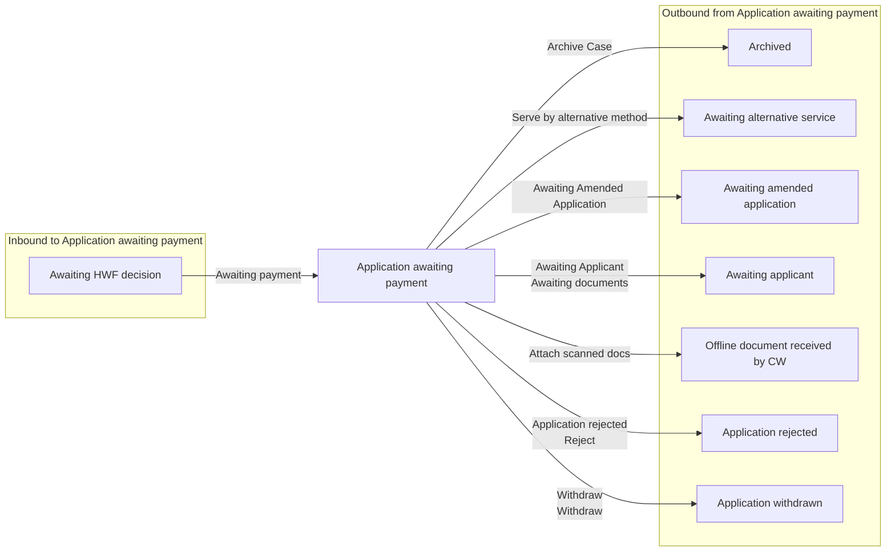

# Application awaiting payment

[Back to No Fault Divorce State Model](../index.md)

State ID: `AwaitingPayment`

## Local state model

## Outgoing events

| Event | End state | Runnable by | Enabling condition |
|---|---|---|---|
| Application rejected (`application-rejected-fee-not-paid`) | [Application rejected](./application-rejected.md) | `caseworker-divorce-systemupdate` | — |
| Attach scanned docs (`attachScannedDocs`) | [Offline document received by CW](./offline-document-received-by-cw.md) | `caseworker-divorce-courtadmin_beta` `caseworker-divorce-systemupdate` | — |
| Awaiting Amended Application (`caseworker-awaiting-amended-application`) | [Awaiting amended application](./awaiting-amended-application.md) | `caseworker-divorce-courtadmin_beta` `caseworker-divorce-superuser` | — |
| Awaiting Applicant (`caseworker-awaiting-applicant`) | [Awaiting applicant](./awaiting-applicant.md) | `caseworker-divorce-courtadmin_beta` | — |
| Awaiting documents (`caseworker-awaiting-documents`) | [Awaiting applicant](./awaiting-applicant.md) | — | — |
| Reject (`caseworker-rejected`) | [Application rejected](./application-rejected.md) | `caseworker-divorce-courtadmin_beta` | — |
| Serve by alternative method (`caseworker-serve-by-alternative-method`) | [Awaiting alternative service](./awaiting-alternative-service.md) | `caseworker-divorce-courtadmin_beta` | — |
| Withdraw (`caseworker-withdrawn`) | [Application withdrawn](./application-withdrawn.md) | `caseworker-divorce-courtadmin_beta` | — |
| Archive Case (`solicitor-archive-case`) | [Archived](./archived.md) | `[APPONESOLICITOR]` | — |
| Withdraw (`superuser-withdrawn`) | [Application withdrawn](./application-withdrawn.md) | `caseworker-divorce-superuser` | — |

## In-state events

| Event | End state | Runnable by | Enabling condition |
|---|---|---|---|
| Update contact info (`app1-solicitor-update-contact-details`) | [Application awaiting payment](./application-awaiting-payment.md) | `[APPONESOLICITOR]` | — |
| View applicant contact info (`app1-solicitor-view-app1-contact-info`) | [Application awaiting payment](./application-awaiting-payment.md) | `[APPONESOLICITOR]` | — |
| View respondent contact info (`app1-solicitor-view-app2-contact-info`) | [Application awaiting payment](./application-awaiting-payment.md) | `[APPONESOLICITOR]` | — |
| Update contact info (`app2-solicitor-update-contact-details`) | [Application awaiting payment](./application-awaiting-payment.md) | `[APPTWOSOLICITOR]` | — |
| View applicant contact info (`app2-solicitor-view-app1-contact-info`) | [Application awaiting payment](./application-awaiting-payment.md) | `[APPTWOSOLICITOR]` | — |
| View respondent contact info (`app2-solicitor-view-app2-contact-info`) | [Application awaiting payment](./application-awaiting-payment.md) | `[APPTWOSOLICITOR]` | — |
| Add bailiff return (`caseworker-add-bailiff-return`) | [Application awaiting payment](./application-awaiting-payment.md) | `caseworker-divorce-courtadmin-la` `caseworker-divorce-courtadmin_beta` | — |
| Add note (`caseworker-add-note`) | [Application awaiting payment](./application-awaiting-payment.md) | `caseworker-divorce-courtadmin_beta` `caseworker-divorce-superuser` | — |
| Add translation (`caseworker-add-translation`) | [Application awaiting payment](./application-awaiting-payment.md) | `caseworker-divorce-courtadmin_beta` | — |
| Amend application type (`caseworker-amend-application-type`) | [Application awaiting payment](./application-awaiting-payment.md) | `caseworker-divorce-superuser` | — |
| Update case (`caseworker-amend-case`) | [Application awaiting payment](./application-awaiting-payment.md) | `caseworker-divorce-courtadmin_beta` | — |
| Confirm service (`caseworker-confirm-service`) | [Application awaiting payment](./application-awaiting-payment.md) | `caseworker-divorce-courtadmin_beta` | `issueDate="*"` |
| Create general email (`caseworker-create-general-email`) | [Application awaiting payment](./application-awaiting-payment.md) | `caseworker-divorce-courtadmin_beta` | — |
| Create general letter (`caseworker-create-general-letter`) | [Application awaiting payment](./application-awaiting-payment.md) | `caseworker-divorce-courtadmin_beta` | — |
| Create general order (`caseworker-create-general-order`) | [Application awaiting payment](./application-awaiting-payment.md) | `caseworker-divorce-courtadmin_beta` | — |
| Find matches (`caseworker-find-matches`) | [Application awaiting payment](./application-awaiting-payment.md) | `caseworker-divorce-courtadmin_beta` `caseworker-divorce-superuser` | — |
| General referral (`caseworker-general-referral`) | [Application awaiting payment](./application-awaiting-payment.md) | `caseworker-divorce-courtadmin_beta` `caseworker-divorce-systemupdate` | — |
| HWF application accepted (`caseworker-hwf-application-accepted`) | [Application awaiting payment](./application-awaiting-payment.md) | `caseworker-divorce-courtadmin_beta` | — |
| Notice of change (`caseworker-notice-of-change`) | [Application awaiting payment](./application-awaiting-payment.md) | `caseworker-divorce-courtadmin_beta` `caseworker-divorce-superuser` | — |
| Payment made (`caseworker-payment-made`) | [Application awaiting payment](./application-awaiting-payment.md) | `caseworker-divorce-courtadmin_beta` | — |
| Prepare for Case flags (`caseworker-prepare-caseflags`) | [Application awaiting payment](./application-awaiting-payment.md) | `caseworker-divorce-courtadmin-la` `caseworker-divorce-courtadmin_beta` `caseworker-divorce-judge` `caseworker-divorce-superuser` | `caseFlagsSetupComplete!="Yes"` |
| Prepare email attachments (`caseworker-prepare-general-email`) | [Application awaiting payment](./application-awaiting-payment.md) | `caseworker-divorce-courtadmin_beta` | — |
| Regenerate court orders (`caseworker-regenerate-court-orders`) | [Application awaiting payment](./application-awaiting-payment.md) | `caseworker-divorce-superuser` | — |
| Reject Service Application (`caseworker-reject-service-application`) | [Application awaiting payment](./application-awaiting-payment.md) | `caseworker-divorce-superuser` | — |
| Remove documents (`caseworker-remove-document`) | [Application awaiting payment](./application-awaiting-payment.md) | `caseworker-divorce-superuser` | — |
| Remove Failed Sol NoC Request (`caseworker-remove-failed-sol-noc-request`) | [Application awaiting payment](./application-awaiting-payment.md) | `caseworker-divorce-superuser` | — |
| Remove general emails (`caseworker-remove-general-emails`) | [Application awaiting payment](./application-awaiting-payment.md) | `caseworker-divorce-superuser` | — |
| Remove general letter (`caseworker-remove-general-letter`) | [Application awaiting payment](./application-awaiting-payment.md) | `caseworker-divorce-superuser` | — |
| Remove General Order (`caseworker-remove-general-order`) | [Application awaiting payment](./application-awaiting-payment.md) | `caseworker-divorce-superuser` | — |
| Remove note (`caseworker-remove-note`) | [Application awaiting payment](./application-awaiting-payment.md) | `caseworker-divorce-superuser` | — |
| Remove scanned document (`caseworker-remove-scanned-document`) | [Application awaiting payment](./application-awaiting-payment.md) | `caseworker-divorce-courtadmin_beta` | — |
| Add RFI Response (`caseworker-request-for-information-response`) | [Application awaiting payment](./application-awaiting-payment.md) | `caseworker-divorce-bulkscan` `caseworker-divorce-courtadmin_beta` `caseworker-divorce-superuser` | — |
| Request Translation from WLU (`caseworker-request-translation-wlu`) | [Application awaiting payment](./application-awaiting-payment.md) | `caseworker-divorce-courtadmin_beta` | — |
| Return to previous state (`caseworker-return-to-previous-state`) | [Application awaiting payment](./application-awaiting-payment.md) | `caseworker-divorce-courtadmin_beta` `caseworker-divorce-superuser` | — |
| Update App or App1 Email (`caseworker-update-app1-email`) | [Application awaiting payment](./application-awaiting-payment.md) | `caseworker-divorce-courtadmin_beta` `caseworker-divorce-superuser` | — |
| Update Resp or App 2 Email (`caseworker-update-app2-email`) | [Application awaiting payment](./application-awaiting-payment.md) | `caseworker-divorce-courtadmin_beta` `caseworker-divorce-superuser` | — |
| Update contact details (`caseworker-update-contact-details`) | [Application awaiting payment](./application-awaiting-payment.md) | `caseworker-divorce-courtadmin_beta` `caseworker-divorce-superuser` | — |
| Update Date Submitted (`caseworker-update-date-submitted`) | [Application awaiting payment](./application-awaiting-payment.md) | `caseworker-divorce-superuser` | — |
| Update due date (`caseworker-update-due-date`) | [Application awaiting payment](./application-awaiting-payment.md) | `caseworker-divorce-courtadmin_beta` `caseworker-divorce-superuser` | — |
| Update FinRem and Jurisdiction (`caseworker-update-fin-rem-and-jurisd-joint`) | [Application awaiting payment](./application-awaiting-payment.md) | `caseworker-divorce-superuser` | `applicationType="jointApplication"` |
| Update FinRem and Jurisdiction (`caseworker-update-fin-rem-and-jurisdiction`) | [Application awaiting payment](./application-awaiting-payment.md) | `caseworker-divorce-superuser` | `applicationType="soleApplication"` |
| Update language preference (`caseworker-update-language-preference`) | [Application awaiting payment](./application-awaiting-payment.md) | `caseworker-divorce-courtadmin_beta` | — |
| Update offline status (`caseworker-update-offline-status`) | [Application awaiting payment](./application-awaiting-payment.md) | `caseworker-divorce-superuser` | — |
| Upload amended application (`caseworker-upload-amended-application`) | [Application awaiting payment](./application-awaiting-payment.md) | `caseworker-divorce-courtadmin_beta` `caseworker-divorce-superuser` | — |
| Upload confidential document (`caseworker-upload-confidential-document`) | [Application awaiting payment](./application-awaiting-payment.md) | `caseworker-divorce-courtadmin_beta` `caseworker-divorce-rparobot` | — |
| Upload document (`caseworker-upload-document`) | [Application awaiting payment](./application-awaiting-payment.md) | `caseworker-divorce-courtadmin_beta` `caseworker-divorce-rparobot` | — |
| Payment reference generated (`citizen-add-payment`) | [Application awaiting payment](./application-awaiting-payment.md) | `citizen` | `divorceOrDissolution="NEVER_SHOW"` |
| Create Payment Service Request (`citizen-create-service-request`) | [Application awaiting payment](./application-awaiting-payment.md) | `caseworker-divorce-systemupdate` `citizen` | `divorceOrDissolution="NEVER_SHOW"` |
| General application payment (`citizen-general-app-payment`) | [Application awaiting payment](./application-awaiting-payment.md) | `[CREATOR]` | `divorceOrDissolution="NEVER_SHOW"` |
| Citizen general application (`citizen-general-application`) | [Application awaiting payment](./application-awaiting-payment.md) | `[CREATOR]` | `divorceOrDissolution="NEVER_SHOW"` |
| Payment made (`citizen-payment-made`) | [Application awaiting payment](./application-awaiting-payment.md) | `caseworker-divorce-systemupdate` `citizen` | `divorceOrDissolution="NEVER_SHOW"` |
| Citizen service application (`citizen-service-application`) | [Application awaiting payment](./application-awaiting-payment.md) | `[CREATOR]` | `divorceOrDissolution="NEVER_SHOW"` |
| Citizen service payment made (`citizen-service-payment-made`) | [Application awaiting payment](./application-awaiting-payment.md) | `[CREATOR]` | `divorceOrDissolution="NEVER_SHOW"` |
| Start Interim Application (`citizen-start-interim-application`) | [Application awaiting payment](./application-awaiting-payment.md) | `[CREATOR]` | `divorceOrDissolution="NEVER_SHOW"` |
| Apply: divorce or dissolution (`citizen-submit-application`) | [Application awaiting payment](./application-awaiting-payment.md) | `citizen` | `divorceOrDissolution="NEVER_SHOW"` |
| Create flags (`createFlags`) | [Application awaiting payment](./application-awaiting-payment.md) | `caseworker-divorce-courtadmin-la` `caseworker-divorce-courtadmin_beta` `caseworker-divorce-judge` `caseworker-divorce-superuser` | `caseFlagsSetupComplete="Yes"` |
| General application received (`cw-general-application-received`) | [Application awaiting payment](./application-awaiting-payment.md) | `caseworker-divorce-courtadmin_beta` | — |
| General application refund (`general-application-refund`) | [Application awaiting payment](./application-awaiting-payment.md) | `caseworker-divorce-superuser` | — |
| Resolve time to live (`manageCaseTTL`) | [Application awaiting payment](./application-awaiting-payment.md) | `TTL_profile` | `divorceOrDissolution="NEVER_SHOW"` |
| Manage flags (`manageFlags`) | [Application awaiting payment](./application-awaiting-payment.md) | `caseworker-divorce-courtadmin-la` `caseworker-divorce-courtadmin_beta` `caseworker-divorce-judge` `caseworker-divorce-superuser` | `caseFlagsSetupComplete="Yes"` |
| Reject general application (`reject-general-application`) | [Application awaiting payment](./application-awaiting-payment.md) | `caseworker-divorce-courtadmin_beta` | — |
| Remission refund (`remission-refund`) | [Application awaiting payment](./application-awaiting-payment.md) | `caseworker-divorce-superuser` | — |
| Service application refund (`service-application-refund`) | [Application awaiting payment](./application-awaiting-payment.md) | `caseworker-divorce-superuser` | — |
| Stop representing client (`solicitor-stop-representation`) | [Application awaiting payment](./application-awaiting-payment.md) | `[APPONESOLICITOR]` `[APPTWOSOLICITOR]` | — |
| Application switched to sole (`switch-to-sole`) | [Application awaiting payment](./application-awaiting-payment.md) | `[APPLICANTTWO]` `[CREATOR]` | `divorceOrDissolution="NEVER_SHOW"` |
| Link Resp or App 2 to case (`system-link-applicant2`) | [Application awaiting payment](./application-awaiting-payment.md) | `caseworker-divorce-systemupdate` | — |
| Migrate case data (`system-migrate-case`) | [Application awaiting payment](./application-awaiting-payment.md) | `caseworker-divorce-systemupdate` | — |
| Migrate organisation policies (`system-migrate-organisation-policies`) | [Application awaiting payment](./application-awaiting-payment.md) | `caseworker-divorce-systemupdate` | — |
| System remove bulk case (`system-remove-bulk-case`) | [Application awaiting payment](./application-awaiting-payment.md) | `caseworker-divorce-superuser` `caseworker-divorce-systemupdate` | — |
| Update issue date (`system-update-issue-date`) | [Application awaiting payment](./application-awaiting-payment.md) | `caseworker-divorce-systemupdate` | — |

## Incoming events

| Event | Start state | Runnable by | Enabling condition |
|---|---|---|---|
| Awaiting payment (`caseworker-awaiting-payment`) | [Awaiting HWF decision](./awaiting-hwf-decision.md) | `caseworker-divorce-courtadmin_beta` | — |
