# Application withdrawn

[Back to No Fault Divorce State Model](../index.md)

State ID: `Withdrawn`

## Local state model

```mermaid
flowchart LR
    current["Application withdrawn"]

    subgraph inbound["Inbound to Application withdrawn"]
        in_aosdrafted["AoS drafted"]
        in_aosoverdue["AoS overdue"]
        in_awaitingadminclarification["Awaiting admin clarification"]
        in_awaitingalternativeservice["Awaiting alternative service"]
        in_awaitingamendedapplication["Awaiting amended application"]
        in_awaitinganswer["AwaitingAnswer"]
        in_awaitingaos["AoS awaiting"]
        in_awaitingbailiffreferral["Awaiting bailiff referral"]
        in_awaitingbailiffservice["Awaiting bailiff service"]
        in_awaitingclarification["Awaiting clarification"]
        in_awaitingconditionalorder["Awaiting conditional order"]
        in_awaitingdocuments["Awaiting applicant"]
        in_awaitingdwpresponse["Awaiting DWP response"]
        in_awaitingfinalorder["Awaiting final order"]
        in_awaitingfinalorderpayment["Awaiting respondent final order payment"]
        in_awaitinggenapphwfevidence["Awaiting GenAppHWF evidence"]
        in_awaitinggenapphwfpartpayment["Awaiting GenAppHWF part payment"]
        in_awaitinggeneralapplicationpayment["Awaiting general application payment"]
        in_awaitinggeneralconsideration["Awaiting general consideration"]
        in_awaitinggeneralreferralpayment["Awaiting general referral payment"]
        in_awaitinghwfdecision["Awaiting HWF decision"]
        in_awaitinghwfevidence["Awaiting HWF evidence"]
        in_awaitinghwfpartpayment["Awaiting HWF part payment"]
        in_awaitingjointfinalorder["Awaiting joint final order"]
        in_awaitingjsnullity["AwaitingJS/Nullity"]
        in_awaitingjudgeclarification["Awaiting judge clarification"]
        in_awaitinglegaladvisorreferral["Awaiting legal advisor referral"]
        in_awaitingpayment["Application awaiting payment"]
        in_awaitingpronouncement["Listed; awaiting pronouncement"]
        in_awaitingrequestedinformation["Awaiting requested information"]
        in_awaitingresponsetohwfdecision["Awaiting response to HWF Decision"]
        in_awaitingservice["Awaiting service"]
        in_awaitingserviceconsideration["Awaiting service consideration"]
        in_awaitingservicepayment["Awaiting service payment"]
        in_bailiffrefused["Bailiff service refused"]
        in_bulkcasereject["Removed from bulk case"]
        in_clarificationsubmitted["Clarification response submitted"]
        in_conditionalorderdrafted["Conditional order drafted"]
        in_conditionalorderpending["Awaiting joint conditional order"]
        in_conditionalorderpronounced["Conditional order pronounced"]
        in_conditionalorderrefused["Conditional order refused"]
        in_conditionalorderreview["Conditional order review caseworker"]
        in_finalordercomplete["Final order complete"]
        in_finalorderpending["Final order pending"]
        in_finalorderrequested["Final order requested"]
        in_generalapplicationreceived["General application received"]
        in_generalconsiderationcomplete["General consideration complete"]
        in_holding["20 week holding period"]
        in_inbulkactioncase["Case in bulk action process"]
        in_informationrequested["Information Requested"]
        in_issuedtobailiff["Issued to bailiff"]
        in_jsawaitingla["Judicial Separation, Awaiting legal advisor"]
        in_lareview["LA Review"]
        in_laservicereview["LA service app review"]
        in_newpapercase["New paper case"]
        in_offlinedocumentreceived["Offline document received by CW"]
        in_pendinghearingdate["Pending hearing date"]
        in_pendinghearingoutcome["Pending hearing outcome"]
        in_pendingrefund["Pending refund"]
        in_pendingserviceappresponse["Pending service app response"]
        in_requestedinformationsubmitted["Requested Information Submitted"]
        in_respondentfinalorderrequested["Respondent Final order requested"]
        in_separationordergranted["Separation order granted"]
        in_serviceadminrefusal["Service Admin Refusal"]
        in_submitted["Submitted"]
        in_welshtranslationrequested["Welsh Translation requested"]
        in_welshtranslationreview["Welsh Translation review"]
    end

    subgraph outbound["Outbound from Application withdrawn"]
        out_offlinedocumentreceived["Offline document received by CW"]
    end

    in_aosdrafted -->|"Withdraw"| current
    in_aosoverdue -->|"Withdraw"| current
    in_awaitingadminclarification -->|"Withdraw"| current
    in_awaitingalternativeservice -->|"Withdraw"| current
    in_awaitingamendedapplication -->|"Withdraw"| current
    in_awaitinganswer -->|"Withdraw"| current
    in_awaitingaos -->|"Withdraw"| current
    in_awaitingbailiffreferral -->|"Withdraw"| current
    in_awaitingbailiffservice -->|"Withdraw"| current
    in_awaitingclarification -->|"Withdraw"| current
    in_awaitingconditionalorder -->|"Withdraw"| current
    in_awaitingdocuments -->|"Withdraw<br/>Withdraw"| current
    in_awaitingdwpresponse -->|"Withdraw"| current
    in_awaitingfinalorder -->|"Withdraw"| current
    in_awaitingfinalorderpayment -->|"Withdraw"| current
    in_awaitinggenapphwfevidence -->|"Withdraw"| current
    in_awaitinggenapphwfpartpayment -->|"Withdraw"| current
    in_awaitinggeneralapplicationpayment -->|"Withdraw"| current
    in_awaitinggeneralconsideration -->|"Withdraw"| current
    in_awaitinggeneralreferralpayment -->|"Withdraw"| current
    in_awaitinghwfdecision -->|"Withdraw<br/>Withdraw"| current
    in_awaitinghwfevidence -->|"Withdraw"| current
    in_awaitinghwfpartpayment -->|"Withdraw"| current
    in_awaitingjointfinalorder -->|"Withdraw"| current
    in_awaitingjsnullity -->|"Withdraw"| current
    in_awaitingjudgeclarification -->|"Withdraw"| current
    in_awaitinglegaladvisorreferral -->|"Withdraw"| current
    in_awaitingpayment -->|"Withdraw<br/>Withdraw"| current
    in_awaitingpronouncement -->|"Withdraw"| current
    in_awaitingrequestedinformation -->|"Withdraw<br/>Withdraw"| current
    in_awaitingresponsetohwfdecision -->|"Withdraw"| current
    in_awaitingservice -->|"Withdraw"| current
    in_awaitingserviceconsideration -->|"Withdraw"| current
    in_awaitingservicepayment -->|"Withdraw"| current
    in_bailiffrefused -->|"Withdraw"| current
    in_bulkcasereject -->|"Withdraw"| current
    in_clarificationsubmitted -->|"Withdraw"| current
    in_conditionalorderdrafted -->|"Withdraw"| current
    in_conditionalorderpending -->|"Withdraw"| current
    in_conditionalorderpronounced -->|"Withdraw"| current
    in_conditionalorderrefused -->|"Withdraw"| current
    in_conditionalorderreview -->|"Withdraw"| current
    in_finalordercomplete -->|"Withdraw"| current
    in_finalorderpending -->|"Withdraw"| current
    in_finalorderrequested -->|"Withdraw"| current
    in_generalapplicationreceived -->|"Withdraw"| current
    in_generalconsiderationcomplete -->|"Withdraw"| current
    in_holding -->|"Withdraw"| current
    in_inbulkactioncase -->|"Withdraw"| current
    in_informationrequested -->|"Withdraw"| current
    in_issuedtobailiff -->|"Withdraw"| current
    in_jsawaitingla -->|"Withdraw"| current
    in_lareview -->|"Withdraw"| current
    in_laservicereview -->|"Withdraw"| current
    in_newpapercase -->|"Withdraw"| current
    in_offlinedocumentreceived -->|"Withdraw"| current
    in_pendinghearingdate -->|"Withdraw"| current
    in_pendinghearingoutcome -->|"Withdraw"| current
    in_pendingrefund -->|"Withdraw"| current
    in_pendingserviceappresponse -->|"Withdraw"| current
    in_requestedinformationsubmitted -->|"Withdraw<br/>Withdraw"| current
    in_respondentfinalorderrequested -->|"Withdraw"| current
    in_separationordergranted -->|"Withdraw"| current
    in_serviceadminrefusal -->|"Withdraw"| current
    in_submitted -->|"Withdraw"| current
    in_welshtranslationrequested -->|"Withdraw"| current
    in_welshtranslationreview -->|"Withdraw"| current
    current -->|"Attach scanned docs"| out_offlinedocumentreceived
```

## Outgoing events

| Event | End state | Runnable by | Enabling condition |
|---|---|---|---|
| Attach scanned docs (`attachScannedDocs`) | [Offline document received by CW](./offline-document-received-by-cw.md) | `caseworker-divorce-courtadmin_beta` `caseworker-divorce-systemupdate` | — |

## In-state events

| Event | End state | Runnable by | Enabling condition |
|---|---|---|---|
| Add note (`caseworker-add-note`) | [Application withdrawn](./application-withdrawn.md) | `caseworker-divorce-courtadmin_beta` `caseworker-divorce-superuser` | — |
| Create general email (`caseworker-create-general-email`) | [Application withdrawn](./application-withdrawn.md) | `caseworker-divorce-courtadmin_beta` | — |
| Create general letter (`caseworker-create-general-letter`) | [Application withdrawn](./application-withdrawn.md) | `caseworker-divorce-courtadmin_beta` | — |
| Prepare email attachments (`caseworker-prepare-general-email`) | [Application withdrawn](./application-withdrawn.md) | `caseworker-divorce-courtadmin_beta` | — |
| Refund (`caseworker-refund`) | [Application withdrawn](./application-withdrawn.md) | `caseworker-divorce-superuser` | — |
| Remove general letter (`caseworker-remove-general-letter`) | [Application withdrawn](./application-withdrawn.md) | `caseworker-divorce-superuser` | — |
| Remove note (`caseworker-remove-note`) | [Application withdrawn](./application-withdrawn.md) | `caseworker-divorce-superuser` | — |
| Update App or App1 Email (`caseworker-update-app1-email`) | [Application withdrawn](./application-withdrawn.md) | `caseworker-divorce-courtadmin_beta` `caseworker-divorce-superuser` | — |
| Update Resp or App 2 Email (`caseworker-update-app2-email`) | [Application withdrawn](./application-withdrawn.md) | `caseworker-divorce-courtadmin_beta` `caseworker-divorce-superuser` | — |
| Update contact details (`caseworker-update-contact-details`) | [Application withdrawn](./application-withdrawn.md) | `caseworker-divorce-courtadmin_beta` `caseworker-divorce-superuser` | — |
| Upload confidential document (`caseworker-upload-confidential-document`) | [Application withdrawn](./application-withdrawn.md) | `caseworker-divorce-courtadmin_beta` `caseworker-divorce-rparobot` | — |
| Upload document (`caseworker-upload-document`) | [Application withdrawn](./application-withdrawn.md) | `caseworker-divorce-courtadmin_beta` `caseworker-divorce-rparobot` | — |
| System remove bulk case (`system-remove-bulk-case`) | [Application withdrawn](./application-withdrawn.md) | `caseworker-divorce-superuser` `caseworker-divorce-systemupdate` | — |
| Unlink Applicant from case (`system-unlink-applicant`) | [Application withdrawn](./application-withdrawn.md) | `citizen` | — |

## Incoming events

| Event | Start state | Runnable by | Enabling condition |
|---|---|---|---|
| Withdraw (`caseworker-withdrawn`) | [AoS drafted](./aos-drafted.md) | `caseworker-divorce-courtadmin_beta` | — |
| Withdraw (`caseworker-withdrawn`) | [AoS overdue](./aos-overdue.md) | `caseworker-divorce-courtadmin_beta` | — |
| Withdraw (`caseworker-withdrawn`) | [Awaiting admin clarification](./awaiting-admin-clarification.md) | `caseworker-divorce-courtadmin_beta` | — |
| Withdraw (`caseworker-withdrawn`) | [Awaiting alternative service](./awaiting-alternative-service.md) | `caseworker-divorce-courtadmin_beta` | — |
| Withdraw (`caseworker-withdrawn`) | [Awaiting amended application](./awaiting-amended-application.md) | `caseworker-divorce-courtadmin_beta` | — |
| Withdraw (`caseworker-withdrawn`) | [AwaitingAnswer](./awaitinganswer.md) | `caseworker-divorce-courtadmin_beta` | — |
| Withdraw (`caseworker-withdrawn`) | [AoS awaiting](./aos-awaiting.md) | `caseworker-divorce-courtadmin_beta` | — |
| Withdraw (`caseworker-withdrawn`) | [Awaiting bailiff referral](./awaiting-bailiff-referral.md) | `caseworker-divorce-courtadmin_beta` | — |
| Withdraw (`caseworker-withdrawn`) | [Awaiting bailiff service](./awaiting-bailiff-service.md) | `caseworker-divorce-courtadmin_beta` | — |
| Withdraw (`caseworker-withdrawn`) | [Awaiting clarification](./awaiting-clarification.md) | `caseworker-divorce-courtadmin_beta` | — |
| Withdraw (`caseworker-withdrawn`) | [Awaiting conditional order](./awaiting-conditional-order.md) | `caseworker-divorce-courtadmin_beta` | — |
| Withdraw (`caseworker-withdrawn`) | [Awaiting applicant](./awaiting-applicant.md) | `caseworker-divorce-courtadmin_beta` | — |
| Withdraw (`caseworker-withdrawn`) | [Awaiting DWP response](./awaiting-dwp-response.md) | `caseworker-divorce-courtadmin_beta` | — |
| Withdraw (`caseworker-withdrawn`) | [Awaiting final order](./awaiting-final-order.md) | `caseworker-divorce-courtadmin_beta` | — |
| Withdraw (`caseworker-withdrawn`) | [Awaiting respondent final order payment](./awaiting-respondent-final-order-payment.md) | `caseworker-divorce-courtadmin_beta` | — |
| Withdraw (`caseworker-withdrawn`) | [Awaiting GenAppHWF evidence](./awaiting-genapphwf-evidence.md) | `caseworker-divorce-courtadmin_beta` | — |
| Withdraw (`caseworker-withdrawn`) | [Awaiting GenAppHWF part payment](./awaiting-genapphwf-part-payment.md) | `caseworker-divorce-courtadmin_beta` | — |
| Withdraw (`caseworker-withdrawn`) | [Awaiting general application payment](./awaiting-general-application-payment.md) | `caseworker-divorce-courtadmin_beta` | — |
| Withdraw (`caseworker-withdrawn`) | [Awaiting general consideration](./awaiting-general-consideration.md) | `caseworker-divorce-courtadmin_beta` | — |
| Withdraw (`caseworker-withdrawn`) | [Awaiting general referral payment](./awaiting-general-referral-payment.md) | `caseworker-divorce-courtadmin_beta` | — |
| Withdraw (`caseworker-withdrawn`) | [Awaiting HWF decision](./awaiting-hwf-decision.md) | `caseworker-divorce-courtadmin_beta` | — |
| Withdraw (`caseworker-withdrawn`) | [Awaiting HWF evidence](./awaiting-hwf-evidence.md) | `caseworker-divorce-courtadmin_beta` | — |
| Withdraw (`caseworker-withdrawn`) | [Awaiting HWF part payment](./awaiting-hwf-part-payment.md) | `caseworker-divorce-courtadmin_beta` | — |
| Withdraw (`caseworker-withdrawn`) | [Awaiting joint final order](./awaiting-joint-final-order.md) | `caseworker-divorce-courtadmin_beta` | — |
| Withdraw (`caseworker-withdrawn`) | [AwaitingJS/Nullity](./awaitingjs-nullity.md) | `caseworker-divorce-courtadmin_beta` | — |
| Withdraw (`caseworker-withdrawn`) | [Awaiting judge clarification](./awaiting-judge-clarification.md) | `caseworker-divorce-courtadmin_beta` | — |
| Withdraw (`caseworker-withdrawn`) | [Awaiting legal advisor referral](./awaiting-legal-advisor-referral.md) | `caseworker-divorce-courtadmin_beta` | — |
| Withdraw (`caseworker-withdrawn`) | [Application awaiting payment](./application-awaiting-payment.md) | `caseworker-divorce-courtadmin_beta` | — |
| Withdraw (`caseworker-withdrawn`) | [Listed; awaiting pronouncement](./listed-awaiting-pronouncement.md) | `caseworker-divorce-courtadmin_beta` | — |
| Withdraw (`caseworker-withdrawn`) | [Awaiting requested information](./awaiting-requested-information.md) | `caseworker-divorce-courtadmin_beta` | — |
| Withdraw (`caseworker-withdrawn`) | [Awaiting response to HWF Decision](./awaiting-response-to-hwf-decision.md) | `caseworker-divorce-courtadmin_beta` | — |
| Withdraw (`caseworker-withdrawn`) | [Awaiting service](./awaiting-service.md) | `caseworker-divorce-courtadmin_beta` | — |
| Withdraw (`caseworker-withdrawn`) | [Awaiting service consideration](./awaiting-service-consideration.md) | `caseworker-divorce-courtadmin_beta` | — |
| Withdraw (`caseworker-withdrawn`) | [Awaiting service payment](./awaiting-service-payment.md) | `caseworker-divorce-courtadmin_beta` | — |
| Withdraw (`caseworker-withdrawn`) | [Bailiff service refused](./bailiff-service-refused.md) | `caseworker-divorce-courtadmin_beta` | — |
| Withdraw (`caseworker-withdrawn`) | [Removed from bulk case](./removed-from-bulk-case.md) | `caseworker-divorce-courtadmin_beta` | — |
| Withdraw (`caseworker-withdrawn`) | [Clarification response submitted](./clarification-response-submitted.md) | `caseworker-divorce-courtadmin_beta` | — |
| Withdraw (`caseworker-withdrawn`) | [Conditional order drafted](./conditional-order-drafted.md) | `caseworker-divorce-courtadmin_beta` | — |
| Withdraw (`caseworker-withdrawn`) | [Awaiting joint conditional order](./awaiting-joint-conditional-order.md) | `caseworker-divorce-courtadmin_beta` | — |
| Withdraw (`caseworker-withdrawn`) | [Conditional order pronounced](./conditional-order-pronounced.md) | `caseworker-divorce-courtadmin_beta` | — |
| Withdraw (`caseworker-withdrawn`) | [Conditional order refused](./conditional-order-refused.md) | `caseworker-divorce-courtadmin_beta` | — |
| Withdraw (`caseworker-withdrawn`) | [Conditional order review caseworker](./conditional-order-review-caseworker.md) | `caseworker-divorce-courtadmin_beta` | — |
| Withdraw (`caseworker-withdrawn`) | [Final order complete](./final-order-complete.md) | `caseworker-divorce-courtadmin_beta` | — |
| Withdraw (`caseworker-withdrawn`) | [Final order pending](./final-order-pending.md) | `caseworker-divorce-courtadmin_beta` | — |
| Withdraw (`caseworker-withdrawn`) | [Final order requested](./final-order-requested.md) | `caseworker-divorce-courtadmin_beta` | — |
| Withdraw (`caseworker-withdrawn`) | [General application received](./general-application-received.md) | `caseworker-divorce-courtadmin_beta` | — |
| Withdraw (`caseworker-withdrawn`) | [General consideration complete](./general-consideration-complete.md) | `caseworker-divorce-courtadmin_beta` | — |
| Withdraw (`caseworker-withdrawn`) | [20 week holding period](./20-week-holding-period.md) | `caseworker-divorce-courtadmin_beta` | — |
| Withdraw (`caseworker-withdrawn`) | [Case in bulk action process](./case-in-bulk-action-process.md) | `caseworker-divorce-courtadmin_beta` | — |
| Withdraw (`caseworker-withdrawn`) | [Information Requested](./information-requested.md) | `caseworker-divorce-courtadmin_beta` | — |
| Withdraw (`caseworker-withdrawn`) | [Issued to bailiff](./issued-to-bailiff.md) | `caseworker-divorce-courtadmin_beta` | — |
| Withdraw (`caseworker-withdrawn`) | [Judicial Separation, Awaiting legal advisor](./judicial-separation-awaiting-legal-advisor.md) | `caseworker-divorce-courtadmin_beta` | — |
| Withdraw (`caseworker-withdrawn`) | [LA Review](./la-review.md) | `caseworker-divorce-courtadmin_beta` | — |
| Withdraw (`caseworker-withdrawn`) | [LA service app review](./la-service-app-review.md) | `caseworker-divorce-courtadmin_beta` | — |
| Withdraw (`caseworker-withdrawn`) | [New paper case](./new-paper-case.md) | `caseworker-divorce-courtadmin_beta` | — |
| Withdraw (`caseworker-withdrawn`) | [Offline document received by CW](./offline-document-received-by-cw.md) | `caseworker-divorce-courtadmin_beta` | — |
| Withdraw (`caseworker-withdrawn`) | [Pending hearing date](./pending-hearing-date.md) | `caseworker-divorce-courtadmin_beta` | — |
| Withdraw (`caseworker-withdrawn`) | [Pending hearing outcome](./pending-hearing-outcome.md) | `caseworker-divorce-courtadmin_beta` | — |
| Withdraw (`caseworker-withdrawn`) | [Pending refund](./pending-refund.md) | `caseworker-divorce-courtadmin_beta` | — |
| Withdraw (`caseworker-withdrawn`) | [Pending service app response](./pending-service-app-response.md) | `caseworker-divorce-courtadmin_beta` | — |
| Withdraw (`caseworker-withdrawn`) | [Requested Information Submitted](./requested-information-submitted.md) | `caseworker-divorce-courtadmin_beta` | — |
| Withdraw (`caseworker-withdrawn`) | [Respondent Final order requested](./respondent-final-order-requested.md) | `caseworker-divorce-courtadmin_beta` | — |
| Withdraw (`caseworker-withdrawn`) | [Separation order granted](./separation-order-granted.md) | `caseworker-divorce-courtadmin_beta` | — |
| Withdraw (`caseworker-withdrawn`) | [Service Admin Refusal](./service-admin-refusal.md) | `caseworker-divorce-courtadmin_beta` | — |
| Withdraw (`caseworker-withdrawn`) | [Submitted](./submitted.md) | `caseworker-divorce-courtadmin_beta` | — |
| Withdraw (`caseworker-withdrawn`) | [Welsh Translation requested](./welsh-translation-requested.md) | `caseworker-divorce-courtadmin_beta` | — |
| Withdraw (`caseworker-withdrawn`) | [Welsh Translation review](./welsh-translation-review.md) | `caseworker-divorce-courtadmin_beta` | — |
| Withdraw (`superuser-withdrawn`) | [Awaiting applicant](./awaiting-applicant.md) | `caseworker-divorce-superuser` | — |
| Withdraw (`superuser-withdrawn`) | [Awaiting HWF decision](./awaiting-hwf-decision.md) | `caseworker-divorce-superuser` | — |
| Withdraw (`superuser-withdrawn`) | [Application awaiting payment](./application-awaiting-payment.md) | `caseworker-divorce-superuser` | — |
| Withdraw (`superuser-withdrawn`) | [Awaiting requested information](./awaiting-requested-information.md) | `caseworker-divorce-superuser` | — |
| Withdraw (`superuser-withdrawn`) | [Requested Information Submitted](./requested-information-submitted.md) | `caseworker-divorce-superuser` | — |
