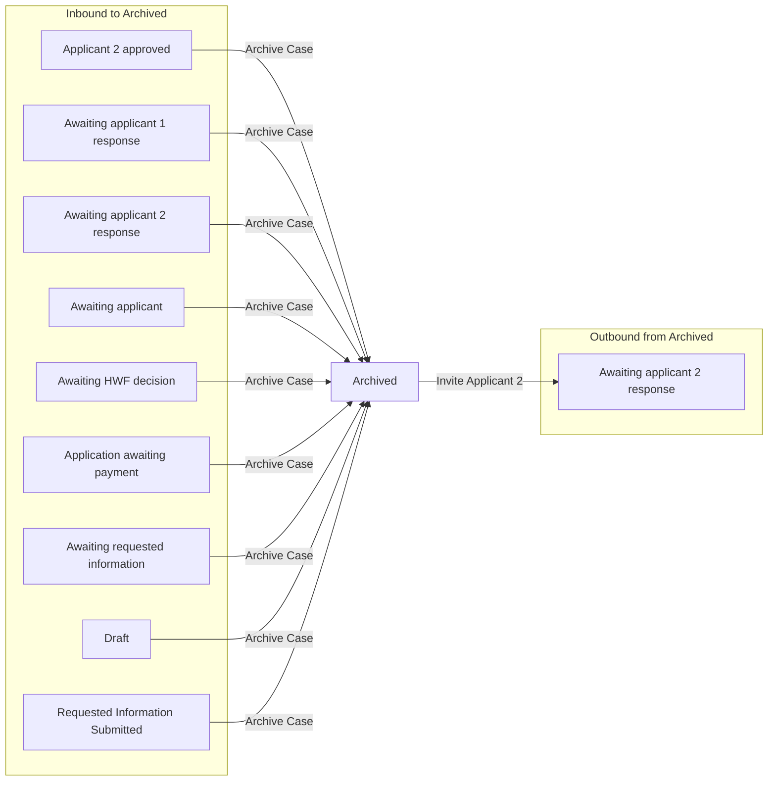

# Archived

[Back to No Fault Divorce State Model](../index.md)

State ID: `Archived`

## Local state model

## Outgoing events

| Event | End state | Runnable by | Enabling condition |
|---|---|---|---|
| Invite Applicant 2 (`invite-applicant2`) | [Awaiting applicant 2 response](./awaiting-applicant-2-response.md) | `[APPONESOLICITOR]` `citizen` | `applicationType="jointApplication"` |

## In-state events

| Event | End state | Runnable by | Enabling condition |
|---|---|---|---|
| View applicant contact info (`app1-solicitor-view-app1-contact-info`) | [Archived](./archived.md) | `[APPONESOLICITOR]` | — |
| View respondent contact info (`app1-solicitor-view-app2-contact-info`) | [Archived](./archived.md) | `[APPONESOLICITOR]` | — |
| View applicant contact info (`app2-solicitor-view-app1-contact-info`) | [Archived](./archived.md) | `[APPTWOSOLICITOR]` | — |
| View respondent contact info (`app2-solicitor-view-app2-contact-info`) | [Archived](./archived.md) | `[APPTWOSOLICITOR]` | — |
| Sign and submit (`solicitor-submit-application`) | [Archived](./archived.md) | `[APPONESOLICITOR]` | `applicationType="soleApplication" OR [STATE]="Applicant2Approved"` |
| Amend divorce application (`solicitor-update-application`) | [Archived](./archived.md) | `[APPONESOLICITOR]` | — |
| Withdraw application (`solicitor-withdrawn`) | [Archived](./archived.md) | `[APPONESOLICITOR]` | — |
| Migrate case data (`system-migrate-case`) | [Archived](./archived.md) | `caseworker-divorce-systemupdate` | — |
| Migrate organisation policies (`system-migrate-organisation-policies`) | [Archived](./archived.md) | `caseworker-divorce-systemupdate` | — |
| Update issue date (`system-update-issue-date`) | [Archived](./archived.md) | `caseworker-divorce-systemupdate` | — |

## Incoming events

| Event | Start state | Runnable by | Enabling condition |
|---|---|---|---|
| Archive Case (`solicitor-archive-case`) | [Applicant 2 approved](./applicant-2-approved.md) | `[APPONESOLICITOR]` | — |
| Archive Case (`solicitor-archive-case`) | [Awaiting applicant 1 response](./awaiting-applicant-1-response.md) | `[APPONESOLICITOR]` | — |
| Archive Case (`solicitor-archive-case`) | [Awaiting applicant 2 response](./awaiting-applicant-2-response.md) | `[APPONESOLICITOR]` | — |
| Archive Case (`solicitor-archive-case`) | [Awaiting applicant](./awaiting-applicant.md) | `[APPONESOLICITOR]` | — |
| Archive Case (`solicitor-archive-case`) | [Awaiting HWF decision](./awaiting-hwf-decision.md) | `[APPONESOLICITOR]` | — |
| Archive Case (`solicitor-archive-case`) | [Application awaiting payment](./application-awaiting-payment.md) | `[APPONESOLICITOR]` | — |
| Archive Case (`solicitor-archive-case`) | [Awaiting requested information](./awaiting-requested-information.md) | `[APPONESOLICITOR]` | — |
| Archive Case (`solicitor-archive-case`) | [Draft](./draft.md) | `[APPONESOLICITOR]` | — |
| Archive Case (`solicitor-archive-case`) | [Requested Information Submitted](./requested-information-submitted.md) | `[APPONESOLICITOR]` | — |
