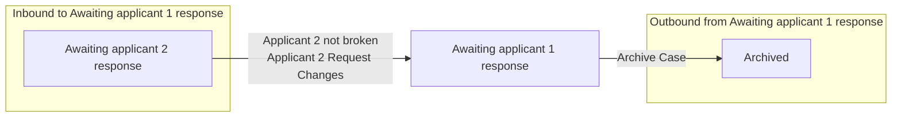

# Awaiting applicant 1 response

[Back to No Fault Divorce State Model](../index.md)

State ID: `AwaitingApplicant1Response`

## Local state model

## Outgoing events

| Event | End state | Runnable by | Enabling condition |
|---|---|---|---|
| Archive Case (`solicitor-archive-case`) | [Archived](./archived.md) | `[APPONESOLICITOR]` | — |

## In-state events

| Event | End state | Runnable by | Enabling condition |
|---|---|---|---|
| View applicant contact info (`app1-solicitor-view-app1-contact-info`) | [Awaiting applicant 1 response](./awaiting-applicant-1-response.md) | `[APPONESOLICITOR]` | — |
| View respondent contact info (`app1-solicitor-view-app2-contact-info`) | [Awaiting applicant 1 response](./awaiting-applicant-1-response.md) | `[APPONESOLICITOR]` | — |
| View applicant contact info (`app2-solicitor-view-app1-contact-info`) | [Awaiting applicant 1 response](./awaiting-applicant-1-response.md) | `[APPTWOSOLICITOR]` | — |
| View respondent contact info (`app2-solicitor-view-app2-contact-info`) | [Awaiting applicant 1 response](./awaiting-applicant-1-response.md) | `[APPTWOSOLICITOR]` | — |
| Resubmit Applicant 1 Answers (`applicant1-resubmit`) | [Awaiting applicant 1 response](./awaiting-applicant-1-response.md) | `[APPONESOLICITOR]` `[CREATOR]` | — |
| Generate Process Server Docs (`citizen-generate-process-server-docs`) | [Awaiting applicant 1 response](./awaiting-applicant-1-response.md) | `[CREATOR]` | `divorceOrDissolution="NEVER_SHOW"` |
| Patch case (`citizen-update-application`) | [Awaiting applicant 1 response](./awaiting-applicant-1-response.md) | `[CREATOR]` | `divorceOrDissolution="NEVER_SHOW"` |
| Amend divorce application (`solicitor-update-application`) | [Awaiting applicant 1 response](./awaiting-applicant-1-response.md) | `[APPONESOLICITOR]` | — |
| Withdraw application (`solicitor-withdrawn`) | [Awaiting applicant 1 response](./awaiting-applicant-1-response.md) | `[APPONESOLICITOR]` | — |
| Application switched to sole (`switch-to-sole`) | [Awaiting applicant 1 response](./awaiting-applicant-1-response.md) | `[APPLICANTTWO]` `[CREATOR]` | `divorceOrDissolution="NEVER_SHOW"` |
| Link Resp or App 2 to case (`system-link-applicant2`) | [Awaiting applicant 1 response](./awaiting-applicant-1-response.md) | `caseworker-divorce-systemupdate` | — |
| Migrate case data (`system-migrate-case`) | [Awaiting applicant 1 response](./awaiting-applicant-1-response.md) | `caseworker-divorce-systemupdate` | — |
| Migrate organisation policies (`system-migrate-organisation-policies`) | [Awaiting applicant 1 response](./awaiting-applicant-1-response.md) | `caseworker-divorce-systemupdate` | — |
| Unlink Applicant from case (`system-unlink-applicant`) | [Awaiting applicant 1 response](./awaiting-applicant-1-response.md) | `citizen` | — |
| Update issue date (`system-update-issue-date`) | [Awaiting applicant 1 response](./awaiting-applicant-1-response.md) | `caseworker-divorce-systemupdate` | — |

## Incoming events

| Event | Start state | Runnable by | Enabling condition |
|---|---|---|---|
| Applicant 2 not broken (`applicant2-not-broken`) | [Awaiting applicant 2 response](./awaiting-applicant-2-response.md) | `[APPLICANTTWO]` | `divorceOrDissolution="NEVER_SHOW"` |
| Applicant 2 Request Changes (`applicant2-request-changes`) | [Awaiting applicant 2 response](./awaiting-applicant-2-response.md) | `[APPLICANTTWO]` `caseworker-divorce-systemupdate` | — |
