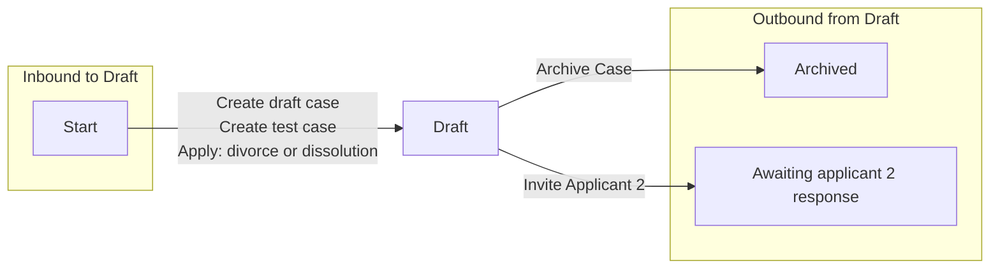

# Draft

[Back to No Fault Divorce State Model](../index.md)

State ID: `Draft`

## Local state model

## Outgoing events

| Event | End state | Runnable by | Enabling condition |
|---|---|---|---|
| Invite Applicant 2 (`invite-applicant2`) | [Awaiting applicant 2 response](./awaiting-applicant-2-response.md) | `[APPONESOLICITOR]` `citizen` | `applicationType="jointApplication"` |
| Archive Case (`solicitor-archive-case`) | [Archived](./archived.md) | `[APPONESOLICITOR]` | — |

## In-state events

| Event | End state | Runnable by | Enabling condition |
|---|---|---|---|
| View applicant contact info (`app1-solicitor-view-app1-contact-info`) | [Draft](./draft.md) | `[APPONESOLICITOR]` | — |
| View respondent contact info (`app1-solicitor-view-app2-contact-info`) | [Draft](./draft.md) | `[APPONESOLICITOR]` | — |
| View applicant contact info (`app2-solicitor-view-app1-contact-info`) | [Draft](./draft.md) | `[APPTWOSOLICITOR]` | — |
| View respondent contact info (`app2-solicitor-view-app2-contact-info`) | [Draft](./draft.md) | `[APPTWOSOLICITOR]` | — |
| Generate Process Server Docs (`citizen-generate-process-server-docs`) | [Draft](./draft.md) | `[CREATOR]` | `divorceOrDissolution="NEVER_SHOW"` |
| Apply: divorce or dissolution (`citizen-submit-application`) | [Draft](./draft.md) | `citizen` | `divorceOrDissolution="NEVER_SHOW"` |
| Patch case (`citizen-update-application`) | [Draft](./draft.md) | `[CREATOR]` | `divorceOrDissolution="NEVER_SHOW"` |
| Resolve time to live (`manageCaseTTL`) | [Draft](./draft.md) | `TTL_profile` | `divorceOrDissolution="NEVER_SHOW"` |
| Sign and submit (`solicitor-submit-application`) | [Draft](./draft.md) | `[APPONESOLICITOR]` | `applicationType="soleApplication" OR [STATE]="Applicant2Approved"` |
| Review and submit application (`solicitor-submit-joint-application`) | [Draft](./draft.md) | `[APPTWOSOLICITOR]` | — |
| Amend divorce application (`solicitor-update-application`) | [Draft](./draft.md) | `[APPONESOLICITOR]` | — |
| Withdraw application (`solicitor-withdrawn`) | [Draft](./draft.md) | `[APPONESOLICITOR]` | — |
| Migrate case data (`system-migrate-case`) | [Draft](./draft.md) | `caseworker-divorce-systemupdate` | — |
| Migrate organisation policies (`system-migrate-organisation-policies`) | [Draft](./draft.md) | `caseworker-divorce-systemupdate` | — |
| System set TTL (`system-set-ttl`) | [Draft](./draft.md) | `caseworker-divorce-systemupdate` | `divorceOrDissolution="NEVER_SHOW"` |
| Unlink Applicant from case (`system-unlink-applicant`) | [Draft](./draft.md) | `citizen` | — |
| Update issue date (`system-update-issue-date`) | [Draft](./draft.md) | `caseworker-divorce-systemupdate` | — |

## Incoming events

| Event | Start state | Runnable by | Enabling condition |
|---|---|---|---|
| Create draft case (`citizen-create-application`) | `__START__` | `citizen` | `divorceOrDissolution="NEVER_SHOW"` |
| Create test case (`create-test-application`) | `__START__` | `caseworker-divorce-solicitor` | — |
| Apply: divorce or dissolution (`solicitor-create-application`) | `__START__` | `caseworker-divorce-solicitor` | — |
