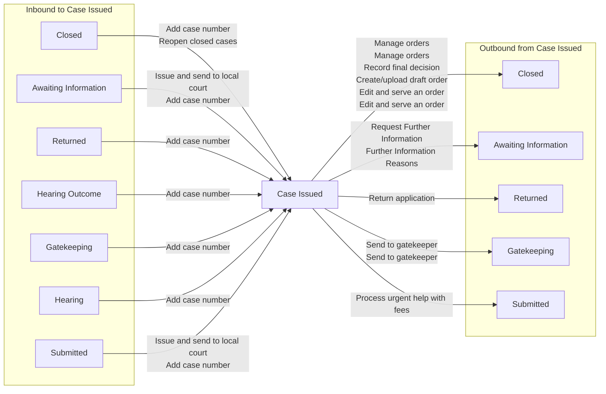

# Case Issued

[Back to Private Law State Model](../index.md)

State ID: `CASE_ISSUED`

## Local state model

## Outgoing events

| Event | End state | Runnable by |
|---|---|---|
| Edit and serve an order (`adminEditAndApproveAnOrder`) | [Closed](./closed.md) | — |
| Create/upload draft order (`draftAnOrder`) | [Closed](./closed.md) | `[C100APPLICANTBARRISTER1]` `[C100APPLICANTBARRISTER2]` `[C100APPLICANTBARRISTER3]` `[C100APPLICANTBARRISTER4]` `[C100APPLICANTBARRISTER5]` `[C100RESPONDENTBARRISTER1]` `[C100RESPONDENTBARRISTER2]` `[C100RESPONDENTBARRISTER3]` `[C100RESPONDENTBARRISTER4]` `[C100RESPONDENTBARRISTER5]` `[FL401APPLICANTBARRISTER]` `[FL401RESPONDENTBARRISTER]` |
| Send to gatekeeper (`fl401SendToGateKeeper`) | [Gatekeeping](./gatekeeping.md) | `hearing-centre-admin`, `allocated-admin-caseworker`, `ctsc`, `allocated-ctsc-caseworker` (`caseworker-privatelaw-courtadmin`) `idam:caseworker-privatelaw-systemupdate` (`caseworker-privatelaw-systemupdate`) |
| Edit and serve an order (`hearingEditAndApproveAnOrder`) | [Closed](./closed.md) | — |
| Manage orders (`manageOrders`) | [Closed](./closed.md) | `hearing-centre-admin`, `allocated-admin-caseworker`, `ctsc`, `allocated-ctsc-caseworker` (`caseworker-privatelaw-courtadmin`) `caseworker-privatelaw-judge` `tribunal-caseworker`, `senior-tribunal-caseworker`, `allocated-legal-adviser` (`caseworker-privatelaw-la`) |
| Process urgent help with fees (`processUrgentHelpWithFees`) | [Submitted](./submitted.md) | `idam:caseworker-privatelaw-systemupdate` (`caseworker-privatelaw-systemupdate`) `hearing-centre-admin`, `allocated-admin-caseworker`, `ctsc`, `allocated-ctsc-caseworker` (`caseworker-privatelaw-courtadmin`) |
| Record final decision (`recordFinalDecision`) | [Closed](./closed.md) | `idam:caseworker-privatelaw-systemupdate` (`caseworker-privatelaw-systemupdate`) `hearing-centre-admin`, `allocated-admin-caseworker`, `ctsc`, `allocated-ctsc-caseworker` (`caseworker-privatelaw-courtadmin`) |
| Request Further Information (`requestFurtherInformation`) | [Awaiting Information](./awaiting-information.md) | `hearing-centre-admin`, `allocated-admin-caseworker`, `ctsc`, `allocated-ctsc-caseworker` (`caseworker-privatelaw-courtadmin`) `ctsc-team-leader` `idam:caseworker-privatelaw-superuser` (`caseworker-privatelaw-superuser`) `idam:caseworker-wa-task-configuration` (`caseworker-wa-task-configuration`) `idam:caseworker-privatelaw-systemupdate` (`caseworker-privatelaw-systemupdate`) `hearing-centre-team-leader` |
| Further Information Reasons (`requestFurtherInformationHistory`) | [Awaiting Information](./awaiting-information.md) | `hearing-centre-admin`, `allocated-admin-caseworker`, `ctsc`, `allocated-ctsc-caseworker` (`caseworker-privatelaw-courtadmin`) `ctsc-team-leader` `idam:caseworker-privatelaw-superuser` (`caseworker-privatelaw-superuser`) `idam:caseworker-wa-task-configuration` (`caseworker-wa-task-configuration`) `idam:caseworker-privatelaw-systemupdate` (`caseworker-privatelaw-systemupdate`) `hearing-centre-team-leader` |
| Return application (`returnApplication`) | [Returned](./returned.md) | `hearing-centre-admin`, `allocated-admin-caseworker`, `ctsc`, `allocated-ctsc-caseworker` (`caseworker-privatelaw-courtadmin`) |
| Send to gatekeeper (`sendToGateKeeper`) | [Gatekeeping](./gatekeeping.md) | `hearing-centre-admin`, `allocated-admin-caseworker`, `ctsc`, `allocated-ctsc-caseworker` (`caseworker-privatelaw-courtadmin`) `idam:caseworker-privatelaw-systemupdate` (`caseworker-privatelaw-systemupdate`) |
| Manage orders (`waManageOrders`) | [Closed](./closed.md) | `hearing-centre-admin`, `allocated-admin-caseworker`, `ctsc`, `allocated-ctsc-caseworker` (`caseworker-privatelaw-courtadmin`) `caseworker-privatelaw-judge` `tribunal-caseworker`, `senior-tribunal-caseworker`, `allocated-legal-adviser` (`caseworker-privatelaw-la`) |

## In-state events

| Event | End state | Runnable by |
|---|---|---|
| Add barrister (`adminAddBarrister`) | [Case Issued](./case-issued.md) | `hearing-centre-admin`, `allocated-admin-caseworker`, `ctsc`, `allocated-ctsc-caseworker` (`caseworker-privatelaw-courtadmin`) `idam:caseworker-privatelaw-superuser` (`caseworker-privatelaw-superuser`) |
| Add local authority (`adminAddLocalAuthority`) | [Case Issued](./case-issued.md) | `hearing-centre-admin`, `allocated-admin-caseworker`, `ctsc`, `allocated-ctsc-caseworker` (`caseworker-privatelaw-courtadmin`) `idam:caseworker-privatelaw-superuser` (`caseworker-privatelaw-superuser`) |
| Remove barrister (`adminRemoveBarrister`) | [Case Issued](./case-issued.md) | `hearing-centre-admin`, `allocated-admin-caseworker`, `ctsc`, `allocated-ctsc-caseworker` (`caseworker-privatelaw-courtadmin`) `idam:caseworker-privatelaw-superuser` (`caseworker-privatelaw-superuser`) |
| Remove legal representative (`adminRemoveLegalRepresentativeC100`) | [Case Issued](./case-issued.md) | `hearing-centre-admin`, `allocated-admin-caseworker`, `ctsc`, `allocated-ctsc-caseworker` (`caseworker-privatelaw-courtadmin`) `idam:caseworker-privatelaw-systemupdate` (`caseworker-privatelaw-systemupdate`) |
| Remove legal representative (`adminRemoveLegalRepresentativeFL401`) | [Case Issued](./case-issued.md) | `hearing-centre-admin`, `allocated-admin-caseworker`, `ctsc`, `allocated-ctsc-caseworker` (`caseworker-privatelaw-courtadmin`) `idam:caseworker-privatelaw-systemupdate` (`caseworker-privatelaw-systemupdate`) |
| Remove local authority (`adminRemoveLocalAuthority`) | [Case Issued](./case-issued.md) | `hearing-centre-admin`, `allocated-admin-caseworker`, `ctsc`, `allocated-ctsc-caseworker` (`caseworker-privatelaw-courtadmin`) `idam:caseworker-privatelaw-superuser` (`caseworker-privatelaw-superuser`) |
| Amend Allegations of harm (`amendAllegationsOfHarm`) | [Case Issued](./case-issued.md) | `hearing-centre-admin`, `allocated-admin-caseworker`, `ctsc`, `allocated-ctsc-caseworker` (`caseworker-privatelaw-courtadmin`) `idam:caseworker-privatelaw-superuser` (`caseworker-privatelaw-superuser`) |
| Amend Allegations of harm (`amendAllegationsOfHarmRevised`) | [Case Issued](./case-issued.md) | — |
| Amend applicant details (`amendApplicantsDetails`) | [Case Issued](./case-issued.md) | `hearing-centre-admin`, `allocated-admin-caseworker`, `ctsc`, `allocated-ctsc-caseworker` (`caseworker-privatelaw-courtadmin`) `caseworker-privatelaw-judge` `tribunal-caseworker`, `senior-tribunal-caseworker`, `allocated-legal-adviser` (`caseworker-privatelaw-la`) `idam:caseworker-privatelaw-superuser` (`caseworker-privatelaw-superuser`) `idam:caseworker-privatelaw-systemupdate` (`caseworker-privatelaw-systemupdate`) |
| Amend attending the hearing (`amendAttendingTheHearing`) | [Case Issued](./case-issued.md) | `hearing-centre-admin`, `allocated-admin-caseworker`, `ctsc`, `allocated-ctsc-caseworker` (`caseworker-privatelaw-courtadmin`) `idam:caseworker-privatelaw-superuser` (`caseworker-privatelaw-superuser`) |
| Amend Child details (`amendChildDetails`) | [Case Issued](./case-issued.md) | `hearing-centre-admin`, `allocated-admin-caseworker`, `ctsc`, `allocated-ctsc-caseworker` (`caseworker-privatelaw-courtadmin`) `caseworker-privatelaw-judge` `tribunal-caseworker`, `senior-tribunal-caseworker`, `allocated-legal-adviser` (`caseworker-privatelaw-la`) `idam:caseworker-privatelaw-superuser` (`caseworker-privatelaw-superuser`) |
| Amend Child details (`amendChildDetailsRevised`) | [Case Issued](./case-issued.md) | `hearing-centre-admin`, `allocated-admin-caseworker`, `ctsc`, `allocated-ctsc-caseworker` (`caseworker-privatelaw-courtadmin`) `caseworker-privatelaw-judge` `tribunal-caseworker`, `senior-tribunal-caseworker`, `allocated-legal-adviser` (`caseworker-privatelaw-la`) `idam:caseworker-privatelaw-superuser` (`caseworker-privatelaw-superuser`) |
| Amend children and applicants (`amendChildrenAndApplicants`) | [Case Issued](./case-issued.md) | `hearing-centre-admin`, `allocated-admin-caseworker`, `ctsc`, `allocated-ctsc-caseworker` (`caseworker-privatelaw-courtadmin`) `caseworker-privatelaw-judge` `tribunal-caseworker`, `senior-tribunal-caseworker`, `allocated-legal-adviser` (`caseworker-privatelaw-la`) `idam:caseworker-privatelaw-superuser` (`caseworker-privatelaw-superuser`) |
| Amend children/other people (`amendChildrenAndOtherPeople`) | [Case Issued](./case-issued.md) | `hearing-centre-admin`, `allocated-admin-caseworker`, `ctsc`, `allocated-ctsc-caseworker` (`caseworker-privatelaw-courtadmin`) `idam:caseworker-privatelaw-superuser` (`caseworker-privatelaw-superuser`) |
| Amend children and respondents (`amendChildrenAndRespondents`) | [Case Issued](./case-issued.md) | `hearing-centre-admin`, `allocated-admin-caseworker`, `ctsc`, `allocated-ctsc-caseworker` (`caseworker-privatelaw-courtadmin`) `caseworker-privatelaw-judge` `tribunal-caseworker`, `senior-tribunal-caseworker`, `allocated-legal-adviser` (`caseworker-privatelaw-la`) `idam:caseworker-privatelaw-superuser` (`caseworker-privatelaw-superuser`) |
| Amend court details (`amendCourtDetails`) | [Case Issued](./case-issued.md) | `hearing-centre-admin`, `allocated-admin-caseworker`, `ctsc`, `allocated-ctsc-caseworker` (`caseworker-privatelaw-courtadmin`) |
| Amend Hearing urgency (`amendHearingUrgency`) | [Case Issued](./case-issued.md) | `hearing-centre-admin`, `allocated-admin-caseworker`, `ctsc`, `allocated-ctsc-caseworker` (`caseworker-privatelaw-courtadmin`) `idam:caseworker-privatelaw-superuser` (`caseworker-privatelaw-superuser`) |
| Amend International element (`amendInternationalElement`) | [Case Issued](./case-issued.md) | `hearing-centre-admin`, `allocated-admin-caseworker`, `ctsc`, `allocated-ctsc-caseworker` (`caseworker-privatelaw-courtadmin`) `idam:caseworker-privatelaw-superuser` (`caseworker-privatelaw-superuser`) |
| Amend Litigation capacity (`amendLitigationCapacity`) | [Case Issued](./case-issued.md) | `hearing-centre-admin`, `allocated-admin-caseworker`, `ctsc`, `allocated-ctsc-caseworker` (`caseworker-privatelaw-courtadmin`) `idam:caseworker-privatelaw-superuser` (`caseworker-privatelaw-superuser`) |
| Amend MIAM (`amendMiam`) | [Case Issued](./case-issued.md) | `hearing-centre-admin`, `allocated-admin-caseworker`, `ctsc`, `allocated-ctsc-caseworker` (`caseworker-privatelaw-courtadmin`) `idam:caseworker-privatelaw-superuser` (`caseworker-privatelaw-superuser`) |
| Amend MIAM (`amendMiamPolicyUpgrade`) | [Case Issued](./case-issued.md) | `hearing-centre-admin`, `allocated-admin-caseworker`, `ctsc`, `allocated-ctsc-caseworker` (`caseworker-privatelaw-courtadmin`) `idam:caseworker-privatelaw-systemupdate` (`caseworker-privatelaw-systemupdate`) |
| Amend children not in the case (`amendOtherChildNotInTheCase`) | [Case Issued](./case-issued.md) | `hearing-centre-admin`, `allocated-admin-caseworker`, `ctsc`, `allocated-ctsc-caseworker` (`caseworker-privatelaw-courtadmin`) `idam:caseworker-privatelaw-superuser` (`caseworker-privatelaw-superuser`) |
| Amend Other people in the case (`amendOtherPeopleInTheCase`) | [Case Issued](./case-issued.md) | `caseworker-privatelaw-judge` `hearing-centre-admin`, `allocated-admin-caseworker`, `ctsc`, `allocated-ctsc-caseworker` (`caseworker-privatelaw-courtadmin`) `idam:caseworker-privatelaw-superuser` (`caseworker-privatelaw-superuser`) |
| Amend Other people in the case (`amendOtherPeopleInTheCaseRevised`) | [Case Issued](./case-issued.md) | `hearing-centre-admin`, `allocated-admin-caseworker`, `ctsc`, `allocated-ctsc-caseworker` (`caseworker-privatelaw-courtadmin`) `idam:caseworker-privatelaw-superuser` (`caseworker-privatelaw-superuser`) |
| Amend Other proceedings (`amendOtherProceedings`) | [Case Issued](./case-issued.md) | `hearing-centre-admin`, `allocated-admin-caseworker`, `ctsc`, `allocated-ctsc-caseworker` (`caseworker-privatelaw-courtadmin`) `idam:caseworker-privatelaw-superuser` (`caseworker-privatelaw-superuser`) |
| Amend respondent's behaviour (`amendRespondentBehaviour`) | [Case Issued](./case-issued.md) | `hearing-centre-admin`, `allocated-admin-caseworker`, `ctsc`, `allocated-ctsc-caseworker` (`caseworker-privatelaw-courtadmin`) `idam:caseworker-privatelaw-superuser` (`caseworker-privatelaw-superuser`) |
| Amend respondent relationship (`amendRespondentRelationship`) | [Case Issued](./case-issued.md) | `hearing-centre-admin`, `allocated-admin-caseworker`, `ctsc`, `allocated-ctsc-caseworker` (`caseworker-privatelaw-courtadmin`) `idam:caseworker-privatelaw-superuser` (`caseworker-privatelaw-superuser`) |
| Amend respondent details (`amendRespondentsDetails`) | [Case Issued](./case-issued.md) | `hearing-centre-admin`, `allocated-admin-caseworker`, `ctsc`, `allocated-ctsc-caseworker` (`caseworker-privatelaw-courtadmin`) `caseworker-privatelaw-judge` `tribunal-caseworker`, `senior-tribunal-caseworker`, `allocated-legal-adviser` (`caseworker-privatelaw-la`) `idam:caseworker-privatelaw-superuser` (`caseworker-privatelaw-superuser`) |
| Amend Type of application (`amendSelectApplicationType`) | [Case Issued](./case-issued.md) | `hearing-centre-admin`, `allocated-admin-caseworker`, `ctsc`, `allocated-ctsc-caseworker` (`caseworker-privatelaw-courtadmin`) `idam:caseworker-privatelaw-superuser` (`caseworker-privatelaw-superuser`) |
| Welsh language requirements (`amendWelshLanguageRequirements`) | [Case Issued](./case-issued.md) | `hearing-centre-admin`, `allocated-admin-caseworker`, `ctsc`, `allocated-ctsc-caseworker` (`caseworker-privatelaw-courtadmin`) `idam:caseworker-privatelaw-superuser` (`caseworker-privatelaw-superuser`) |
| Amend without notice order (`amendWithoutNoticeOrderDetails`) | [Case Issued](./case-issued.md) | `hearing-centre-admin`, `allocated-admin-caseworker`, `ctsc`, `allocated-ctsc-caseworker` (`caseworker-privatelaw-courtadmin`) `idam:caseworker-privatelaw-superuser` (`caseworker-privatelaw-superuser`) |
| Attach scanned docs (`attachScannedDocs`) | [Case Issued](./case-issued.md) | `caseworker-privatelaw-bulkscansystemupdate` `idam:caseworker-privatelaw-systemupdate` (`caseworker-privatelaw-systemupdate`) `caseworker-privatelaw-bulkscan` `hearing-centre-admin`, `allocated-admin-caseworker`, `ctsc`, `allocated-ctsc-caseworker` (`caseworker-privatelaw-courtadmin`) |
| Stop representing client (`barristerStopRepresenting`) | [Case Issued](./case-issued.md) | `[C100APPLICANTBARRISTER1]` `[C100APPLICANTBARRISTER2]` `[C100APPLICANTBARRISTER3]` `[C100APPLICANTBARRISTER4]` `[C100APPLICANTBARRISTER5]` `[C100RESPONDENTBARRISTER1]` `[C100RESPONDENTBARRISTER2]` `[C100RESPONDENTBARRISTER3]` `[C100RESPONDENTBARRISTER4]` `[C100RESPONDENTBARRISTER5]` `[FL401APPLICANTBARRISTER]` `[FL401RESPONDENTBARRISTER]` |
| Manage support (`c100ManageSupport`) | [Case Issued](./case-issued.md) | `idam:citizen` (`citizen`) `[CREATOR]` `[APPLICANTSOLICITOR]` `[C100APPLICANTSOLICITOR1]` `[C100APPLICANTSOLICITOR2]` `[C100APPLICANTSOLICITOR3]` `[C100APPLICANTSOLICITOR4]` `[C100APPLICANTSOLICITOR5]` `[C100RESPONDENTSOLICITOR1]` `[C100RESPONDENTSOLICITOR2]` `[C100RESPONDENTSOLICITOR3]` `[C100RESPONDENTSOLICITOR4]` `[C100RESPONDENTSOLICITOR5]` `idam:caseworker-privatelaw-systemupdate` (`caseworker-privatelaw-systemupdate`) |
| Request support (`c100RequestSupport`) | [Case Issued](./case-issued.md) | `idam:citizen` (`citizen`) `[CREATOR]` `[APPLICANTSOLICITOR]` `[C100APPLICANTSOLICITOR1]` `[C100APPLICANTSOLICITOR2]` `[C100APPLICANTSOLICITOR3]` `[C100APPLICANTSOLICITOR4]` `[C100APPLICANTSOLICITOR5]` `[C100RESPONDENTSOLICITOR1]` `[C100RESPONDENTSOLICITOR2]` `[C100RESPONDENTSOLICITOR3]` `[C100RESPONDENTSOLICITOR4]` `[C100RESPONDENTSOLICITOR5]` `idam:caseworker-privatelaw-systemupdate` (`caseworker-privatelaw-systemupdate`) |
| Add case number (`caseNumber`) | [Case Issued](./case-issued.md) | `hearing-centre-admin`, `allocated-admin-caseworker`, `ctsc`, `allocated-ctsc-caseworker` (`caseworker-privatelaw-courtadmin`) |
| Link cases (`createCaseLink`) | [Case Issued](./case-issued.md) | — |
| Edit a returned order (`editReturnedOrder`) | [Case Issued](./case-issued.md) | `[C100APPLICANTBARRISTER1]` `[C100APPLICANTBARRISTER2]` `[C100APPLICANTBARRISTER3]` `[C100APPLICANTBARRISTER4]` `[C100APPLICANTBARRISTER5]` `[C100RESPONDENTBARRISTER1]` `[C100RESPONDENTBARRISTER2]` `[C100RESPONDENTBARRISTER3]` `[C100RESPONDENTBARRISTER4]` `[C100RESPONDENTBARRISTER5]` `[FL401APPLICANTBARRISTER]` `[FL401RESPONDENTBARRISTER]` `[C100RESPONDENTSOLICITOR1]` `[C100RESPONDENTSOLICITOR2]` `[C100RESPONDENTSOLICITOR3]` `[C100RESPONDENTSOLICITOR4]` `[C100RESPONDENTSOLICITOR5]` `[C100APPLICANTSOLICITOR1]` `[C100APPLICANTSOLICITOR2]` `[C100APPLICANTSOLICITOR3]` `[C100APPLICANTSOLICITOR4]` `[C100APPLICANTSOLICITOR5]` `[FL401RESPONDENTSOLICITOR]` `[FL401APPLICANTSOLICITOR]` `[APPLICANTSOLICITOR]` `[CREATOR]` `idam:caseworker-privatelaw-superuser` (`caseworker-privatelaw-superuser`) |
| Add case number (`fl401AddCaseNumber`) | [Case Issued](./case-issued.md) | `hearing-centre-admin`, `allocated-admin-caseworker`, `ctsc`, `allocated-ctsc-caseworker` (`caseworker-privatelaw-courtadmin`) |
| Amend applicant’s family (`fl401AmendApplicantFamilyDetails`) | [Case Issued](./case-issued.md) | `hearing-centre-admin`, `allocated-admin-caseworker`, `ctsc`, `allocated-ctsc-caseworker` (`caseworker-privatelaw-courtadmin`) `idam:caseworker-privatelaw-superuser` (`caseworker-privatelaw-superuser`) |
| Amend the home details (`fl401AmendHome`) | [Case Issued](./case-issued.md) | `hearing-centre-admin`, `allocated-admin-caseworker`, `ctsc`, `allocated-ctsc-caseworker` (`caseworker-privatelaw-courtadmin`) `idam:caseworker-privatelaw-superuser` (`caseworker-privatelaw-superuser`) |
| Amend other proceedings (`fl401AmendOtherProceedings`) | [Case Issued](./case-issued.md) | `hearing-centre-admin`, `allocated-admin-caseworker`, `ctsc`, `allocated-ctsc-caseworker` (`caseworker-privatelaw-courtadmin`) `idam:caseworker-privatelaw-superuser` (`caseworker-privatelaw-superuser`) |
| Amend type of application (`fl401AmendTypeOfApplication`) | [Case Issued](./case-issued.md) | `hearing-centre-admin`, `allocated-admin-caseworker`, `ctsc`, `allocated-ctsc-caseworker` (`caseworker-privatelaw-courtadmin`) `idam:caseworker-privatelaw-superuser` (`caseworker-privatelaw-superuser`) |
| Manage support (`fl401ManageSupport`) | [Case Issued](./case-issued.md) | `idam:citizen` (`citizen`) `[CREATOR]` `[APPLICANTSOLICITOR]` `[FL401APPLICANTSOLICITOR]` `[FL401RESPONDENTSOLICITOR]` `idam:caseworker-privatelaw-systemupdate` (`caseworker-privatelaw-systemupdate`) |
| Request support (`fl401RequestSupport`) | [Case Issued](./case-issued.md) | `idam:citizen` (`citizen`) `[CREATOR]` `[APPLICANTSOLICITOR]` `[FL401APPLICANTSOLICITOR]` `[FL401RESPONDENTSOLICITOR]` `idam:caseworker-privatelaw-systemupdate` (`caseworker-privatelaw-systemupdate`) |
| Manage case links (`maintainCaseLink`) | [Case Issued](./case-issued.md) | — |
| Manage documents (`manageDocuments`) | [Case Issued](./case-issued.md) | — |
| Manage documents (`manageDocumentsNew`) | [Case Issued](./case-issued.md) | `idam:caseworker-privatelaw-solicitor` (`caseworker-privatelaw-solicitor`) `idam:citizen` (`citizen`) `hearing-centre-admin`, `allocated-admin-caseworker`, `ctsc`, `allocated-ctsc-caseworker` (`caseworker-privatelaw-courtadmin`) `caseworker-privatelaw-judge` `tribunal-caseworker`, `senior-tribunal-caseworker`, `allocated-legal-adviser` (`caseworker-privatelaw-la`) `idam:caseworker-privatelaw-systemupdate` (`caseworker-privatelaw-systemupdate`) `listed-hearing-viewer`, `caseworker-privatelaw-externaluser-viewonly` (`caseworker-privatelaw-externaluser-viewonly`) `[C100APPLICANTBARRISTER1]` `[C100APPLICANTBARRISTER2]` `[C100APPLICANTBARRISTER3]` `[C100APPLICANTBARRISTER4]` `[C100APPLICANTBARRISTER5]` `[C100RESPONDENTBARRISTER1]` `[C100RESPONDENTBARRISTER2]` `[C100RESPONDENTBARRISTER3]` `[C100RESPONDENTBARRISTER4]` `[C100RESPONDENTBARRISTER5]` `[FL401APPLICANTBARRISTER]` `[FL401RESPONDENTBARRISTER]` `[LASOCIALWORKER]` `[LASOLICITOR]` |
| Pathfinder decision (`pathfinderDecision`) | [Case Issued](./case-issued.md) | `hearing-centre-admin`, `allocated-admin-caseworker`, `ctsc`, `allocated-ctsc-caseworker` (`caseworker-privatelaw-courtadmin`) `idam:caseworker-privatelaw-systemupdate` (`caseworker-privatelaw-systemupdate`) `caseworker-privatelaw-judge` `tribunal-caseworker`, `senior-tribunal-caseworker`, `allocated-legal-adviser` (`caseworker-privatelaw-la`) |
| Remove draft order (`removeDraftOrder`) | [Case Issued](./case-issued.md) | — |
| Resend RPA (`resendRpa`) | [Case Issued](./case-issued.md) | `hearing-centre-admin`, `allocated-admin-caseworker`, `ctsc`, `allocated-ctsc-caseworker` (`caseworker-privatelaw-courtadmin`) |
| Review Additional Application (`reviewAdditionalApplication`) | [Case Issued](./case-issued.md) | `hearing-centre-admin`, `allocated-admin-caseworker`, `ctsc`, `allocated-ctsc-caseworker` (`caseworker-privatelaw-courtadmin`) `caseworker-privatelaw-judge` `tribunal-caseworker`, `senior-tribunal-caseworker`, `allocated-legal-adviser` (`caseworker-privatelaw-la`) `idam:caseworker-privatelaw-systemupdate` (`caseworker-privatelaw-systemupdate`) `idam:caseworker-privatelaw-superuser` (`caseworker-privatelaw-superuser`) |
| Review documents (`reviewDocuments`) | [Case Issued](./case-issued.md) | `hearing-centre-admin`, `allocated-admin-caseworker`, `ctsc`, `allocated-ctsc-caseworker` (`caseworker-privatelaw-courtadmin`) `idam:caseworker-privatelaw-systemupdate` (`caseworker-privatelaw-systemupdate`) |
| Send and reply to messages (`sendOrReplyToMessages`) | [Case Issued](./case-issued.md) | `hearing-centre-admin`, `allocated-admin-caseworker`, `ctsc`, `allocated-ctsc-caseworker` (`caseworker-privatelaw-courtadmin`) `caseworker-privatelaw-judge` `tribunal-caseworker`, `senior-tribunal-caseworker`, `allocated-legal-adviser` (`caseworker-privatelaw-la`) |
| Add barrister (`solicitorAddBarrister`) | [Case Issued](./case-issued.md) | `[C100RESPONDENTSOLICITOR1]` `[C100RESPONDENTSOLICITOR2]` `[C100RESPONDENTSOLICITOR3]` `[C100RESPONDENTSOLICITOR4]` `[C100RESPONDENTSOLICITOR5]` `[C100APPLICANTSOLICITOR1]` `[C100APPLICANTSOLICITOR2]` `[C100APPLICANTSOLICITOR3]` `[C100APPLICANTSOLICITOR4]` `[C100APPLICANTSOLICITOR5]` `[FL401RESPONDENTSOLICITOR]` `[FL401APPLICANTSOLICITOR]` `[APPLICANTSOLICITOR]` |
| Remove barrister (`solicitorRemoveBarrister`) | [Case Issued](./case-issued.md) | `[C100RESPONDENTSOLICITOR1]` `[C100RESPONDENTSOLICITOR2]` `[C100RESPONDENTSOLICITOR3]` `[C100RESPONDENTSOLICITOR4]` `[C100RESPONDENTSOLICITOR5]` `[C100APPLICANTSOLICITOR1]` `[C100APPLICANTSOLICITOR2]` `[C100APPLICANTSOLICITOR3]` `[C100APPLICANTSOLICITOR4]` `[C100APPLICANTSOLICITOR5]` `[FL401RESPONDENTSOLICITOR]` `[FL401APPLICANTSOLICITOR]` `[APPLICANTSOLICITOR]` |
| Stop representing client (`solicitorStopRepresentingLiP`) | [Case Issued](./case-issued.md) | `[APPLICANTSOLICITOR]` `[CREATOR]` `[C100APPLICANTSOLICITOR1]` `[C100APPLICANTSOLICITOR2]` `[C100APPLICANTSOLICITOR3]` `[C100APPLICANTSOLICITOR4]` `[C100APPLICANTSOLICITOR5]` `[C100RESPONDENTSOLICITOR1]` `[C100RESPONDENTSOLICITOR2]` `[C100RESPONDENTSOLICITOR3]` `[C100RESPONDENTSOLICITOR4]` `[C100RESPONDENTSOLICITOR5]` `[FL401APPLICANTSOLICITOR]` `[FL401RESPONDENTSOLICITOR]` `idam:caseworker-privatelaw-systemupdate` (`caseworker-privatelaw-systemupdate`) |
| Transfer to another court (`transferToAnotherCourt`) | [Case Issued](./case-issued.md) | `hearing-centre-admin`, `allocated-admin-caseworker`, `ctsc`, `allocated-ctsc-caseworker` (`caseworker-privatelaw-courtadmin`) `idam:caseworker-privatelaw-systemupdate` (`caseworker-privatelaw-systemupdate`) |
| Upload additional applications (`uploadAdditionalApplications`) | [Case Issued](./case-issued.md) | `[APPLICANTSOLICITOR]` `[C100APPLICANTSOLICITOR1]` `[C100APPLICANTSOLICITOR2]` `[C100APPLICANTSOLICITOR3]` `[C100APPLICANTSOLICITOR4]` `[C100APPLICANTSOLICITOR5]` `[C100RESPONDENTSOLICITOR1]` `[C100RESPONDENTSOLICITOR2]` `[C100RESPONDENTSOLICITOR3]` `[C100RESPONDENTSOLICITOR4]` `[C100RESPONDENTSOLICITOR5]` `[FL401APPLICANTSOLICITOR]` `[FL401RESPONDENTSOLICITOR]` `idam:caseworker-privatelaw-systemupdate` (`caseworker-privatelaw-systemupdate`) |
| Send and reply to messages (`waSendOrReplyToMessages`) | [Case Issued](./case-issued.md) | `hearing-centre-admin`, `allocated-admin-caseworker`, `ctsc`, `allocated-ctsc-caseworker` (`caseworker-privatelaw-courtadmin`) `caseworker-privatelaw-judge` `tribunal-caseworker`, `senior-tribunal-caseworker`, `allocated-legal-adviser` (`caseworker-privatelaw-la`) |

## Incoming events

| Event | Start state | Runnable by |
|---|---|---|
| Add case number (`fl401AddCaseNumber`) | [Closed](./closed.md) | `hearing-centre-admin`, `allocated-admin-caseworker`, `ctsc`, `allocated-ctsc-caseworker` (`caseworker-privatelaw-courtadmin`) |
| Add case number (`fl401AddCaseNumber`) | [Awaiting Information](./awaiting-information.md) | `hearing-centre-admin`, `allocated-admin-caseworker`, `ctsc`, `allocated-ctsc-caseworker` (`caseworker-privatelaw-courtadmin`) |
| Add case number (`fl401AddCaseNumber`) | [Returned](./returned.md) | `hearing-centre-admin`, `allocated-admin-caseworker`, `ctsc`, `allocated-ctsc-caseworker` (`caseworker-privatelaw-courtadmin`) |
| Add case number (`fl401AddCaseNumber`) | [Hearing Outcome](./hearing-outcome.md) | `hearing-centre-admin`, `allocated-admin-caseworker`, `ctsc`, `allocated-ctsc-caseworker` (`caseworker-privatelaw-courtadmin`) |
| Add case number (`fl401AddCaseNumber`) | [Gatekeeping](./gatekeeping.md) | `hearing-centre-admin`, `allocated-admin-caseworker`, `ctsc`, `allocated-ctsc-caseworker` (`caseworker-privatelaw-courtadmin`) |
| Add case number (`fl401AddCaseNumber`) | [Hearing](./hearing.md) | `hearing-centre-admin`, `allocated-admin-caseworker`, `ctsc`, `allocated-ctsc-caseworker` (`caseworker-privatelaw-courtadmin`) |
| Add case number (`fl401AddCaseNumber`) | [Submitted](./submitted.md) | `hearing-centre-admin`, `allocated-admin-caseworker`, `ctsc`, `allocated-ctsc-caseworker` (`caseworker-privatelaw-courtadmin`) |
| Issue and send to local court (`issueAndSendToLocalCourtCallback`) | [Awaiting Information](./awaiting-information.md) | `hearing-centre-admin`, `allocated-admin-caseworker`, `ctsc`, `allocated-ctsc-caseworker` (`caseworker-privatelaw-courtadmin`) |
| Issue and send to local court (`issueAndSendToLocalCourtCallback`) | [Submitted](./submitted.md) | `hearing-centre-admin`, `allocated-admin-caseworker`, `ctsc`, `allocated-ctsc-caseworker` (`caseworker-privatelaw-courtadmin`) |
| Reopen closed cases (`reopenClosedCases`) | [Closed](./closed.md) | `hearing-centre-team-leader` `idam:caseworker-privatelaw-systemupdate` (`caseworker-privatelaw-systemupdate`) |
