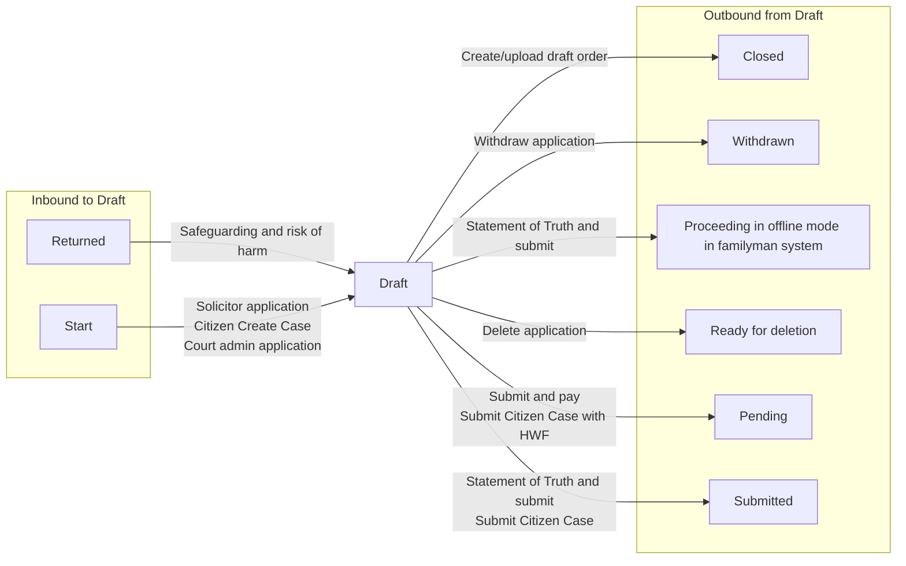

# Draft

[Back to Private Law State Model](../index.md)

State ID: `AWAITING_SUBMISSION_TO_HMCTS`

## Local state model

## Outgoing events

| Event | End state | Runnable by |
|---|---|---|
| Withdraw application (`WithdrawApplication_Event`) | [Withdrawn](./withdrawn.md) | `[APPLICANTSOLICITOR]` `[CREATOR]` `idam:citizen` (`citizen`) |
| Submit Citizen Case (`citizen-case-submit`) | [Submitted](./submitted.md) | `idam:citizen` (`citizen`) `idam:caseworker-privatelaw-systemupdate` (`caseworker-privatelaw-systemupdate`) |
| Submit Citizen Case with HWF (`citizenCaseSubmitWithHWF`) | [Pending](./pending.md) | `idam:citizen` (`citizen`) `idam:caseworker-privatelaw-systemupdate` (`caseworker-privatelaw-systemupdate`) |
| Delete application (`deleteApplication`) | [Ready for deletion](./ready-for-deletion.md) | `[APPLICANTSOLICITOR]` `[CREATOR]` `idam:citizen` (`citizen`) `idam:caseworker-privatelaw-systemupdate` (`caseworker-privatelaw-systemupdate`) |
| Create/upload draft order (`draftAnOrder`) | [Closed](./closed.md) | `[C100APPLICANTBARRISTER1]` `[C100APPLICANTBARRISTER2]` `[C100APPLICANTBARRISTER3]` `[C100APPLICANTBARRISTER4]` `[C100APPLICANTBARRISTER5]` `[C100RESPONDENTBARRISTER1]` `[C100RESPONDENTBARRISTER2]` `[C100RESPONDENTBARRISTER3]` `[C100RESPONDENTBARRISTER4]` `[C100RESPONDENTBARRISTER5]` `[FL401APPLICANTBARRISTER]` `[FL401RESPONDENTBARRISTER]` |
| Statement of Truth and submit (`fl401StatementOfTruthAndSubmit`) | [Proceeding in offline mode in familyman system](./proceeding-in-offline-mode-in-familyman-system.md) | `[APPLICANTSOLICITOR]` `[CREATOR]` `idam:citizen` (`citizen`) `hearing-centre-admin` `allocated-admin-caseworker` `ctsc` `allocated-ctsc-caseworker` (`caseworker-privatelaw-courtadmin`) `idam:caseworker-privatelaw-systemupdate` (`caseworker-privatelaw-systemupdate`) |
| Statement of Truth and submit (`fl401StatementOfTruthAndSubmit`) | [Submitted](./submitted.md) | `[APPLICANTSOLICITOR]` `[CREATOR]` `idam:citizen` (`citizen`) `hearing-centre-admin` `allocated-admin-caseworker` `ctsc` `allocated-ctsc-caseworker` (`caseworker-privatelaw-courtadmin`) `idam:caseworker-privatelaw-systemupdate` (`caseworker-privatelaw-systemupdate`) |
| Submit and pay (`submitAndPay`) | [Pending](./pending.md) | `[APPLICANTSOLICITOR]` `[CREATOR]` `idam:citizen` (`citizen`) `idam:caseworker-privatelaw-systemupdate` (`caseworker-privatelaw-systemupdate`) `hearing-centre-admin` `allocated-admin-caseworker` `ctsc` `allocated-ctsc-caseworker` (`caseworker-privatelaw-courtadmin`) |

## In-state events

| Event | End state | Runnable by |
|---|---|---|
| Allegations of harm (`allegationsOfHarm`) | [Draft](./draft.md) | `[APPLICANTSOLICITOR]` `[CREATOR]` `idam:citizen` (`citizen`) `idam:caseworker-privatelaw-systemupdate` (`caseworker-privatelaw-systemupdate`) |
| Allegations of harm (`allegationsOfHarmRevised`) | [Draft](./draft.md) | — |
| Applicant details (`applicantsDetails`) | [Draft](./draft.md) | `[APPLICANTSOLICITOR]` `[CREATOR]` `idam:citizen` (`citizen`) `idam:caseworker-privatelaw-systemupdate` (`caseworker-privatelaw-systemupdate`) |
| Attending the hearing (`attendingTheHearing`) | [Draft](./draft.md) | `[APPLICANTSOLICITOR]` `[CREATOR]` `idam:citizen` (`citizen`) `idam:caseworker-privatelaw-systemupdate` (`caseworker-privatelaw-systemupdate`) |
| Child details (`childDetails`) | [Draft](./draft.md) | `[APPLICANTSOLICITOR]` `[CREATOR]` `idam:citizen` (`citizen`) `idam:caseworker-privatelaw-systemupdate` (`caseworker-privatelaw-systemupdate`) |
| Child details (`childDetailsRevised`) | [Draft](./draft.md) | `[APPLICANTSOLICITOR]` `[CREATOR]` `idam:citizen` (`citizen`) `idam:caseworker-privatelaw-systemupdate` (`caseworker-privatelaw-systemupdate`) |
| Children and applicants (`childrenAndApplicants`) | [Draft](./draft.md) | `[APPLICANTSOLICITOR]` `[CREATOR]` `idam:citizen` (`citizen`) `idam:caseworker-privatelaw-systemupdate` (`caseworker-privatelaw-systemupdate`) |
| Children and other people (`childrenAndOtherPeople`) | [Draft](./draft.md) | `[APPLICANTSOLICITOR]` `[CREATOR]` `idam:citizen` (`citizen`) `idam:caseworker-privatelaw-systemupdate` (`caseworker-privatelaw-systemupdate`) |
| Children and respondents (`childrenAndRespondents`) | [Draft](./draft.md) | `[APPLICANTSOLICITOR]` `[CREATOR]` `idam:citizen` (`citizen`) `idam:caseworker-privatelaw-systemupdate` (`caseworker-privatelaw-systemupdate`) |
| Citizen saving C100 draft (`citizenSaveC100DraftInternal`) | [Draft](./draft.md) | `idam:citizen` (`citizen`) `idam:caseworker-privatelaw-systemupdate` (`caseworker-privatelaw-systemupdate`) |
| Applicant’s family (`fl401ApplicantFamilyDetails`) | [Draft](./draft.md) | `[APPLICANTSOLICITOR]` `[CREATOR]` `idam:citizen` (`citizen`) `idam:caseworker-privatelaw-systemupdate` (`caseworker-privatelaw-systemupdate`) |
| The home (`fl401Home`) | [Draft](./draft.md) | `[APPLICANTSOLICITOR]` `[CREATOR]` `idam:citizen` (`citizen`) `idam:caseworker-privatelaw-systemupdate` (`caseworker-privatelaw-systemupdate`) |
| Other proceedings (`fl401OtherProceedings`) | [Draft](./draft.md) | `[APPLICANTSOLICITOR]` `[CREATOR]` `idam:citizen` (`citizen`) `idam:caseworker-privatelaw-systemupdate` (`caseworker-privatelaw-systemupdate`) |
| Type of application (`fl401TypeOfApplication`) | [Draft](./draft.md) | `[APPLICANTSOLICITOR]` `[CREATOR]` `idam:citizen` (`citizen`) `idam:caseworker-privatelaw-systemupdate` (`caseworker-privatelaw-systemupdate`) |
| Upload documents (`fl401UploadDocuments`) | [Draft](./draft.md) | `[APPLICANTSOLICITOR]` `[CREATOR]` `idam:citizen` (`citizen`) `idam:caseworker-privatelaw-systemupdate` (`caseworker-privatelaw-systemupdate`) |
| Hearing urgency (`hearingUrgency`) | [Draft](./draft.md) | `[APPLICANTSOLICITOR]` `[CREATOR]` `idam:citizen` (`citizen`) `idam:caseworker-privatelaw-systemupdate` (`caseworker-privatelaw-systemupdate`) |
| International element (`internationalElement`) | [Draft](./draft.md) | `[APPLICANTSOLICITOR]` `[CREATOR]` `idam:citizen` (`citizen`) `idam:caseworker-privatelaw-systemupdate` (`caseworker-privatelaw-systemupdate`) |
| Litigation capacity (`litigationCapacity`) | [Draft](./draft.md) | `[APPLICANTSOLICITOR]` `[CREATOR]` `idam:citizen` (`citizen`) `idam:caseworker-privatelaw-systemupdate` (`caseworker-privatelaw-systemupdate`) |
| MIAM (`miam`) | [Draft](./draft.md) | `[APPLICANTSOLICITOR]` `[CREATOR]` `idam:citizen` (`citizen`) `idam:caseworker-privatelaw-systemupdate` (`caseworker-privatelaw-systemupdate`) |
| MIAM (`miamPolicyUpgrade`) | [Draft](./draft.md) | `[CREATOR]` `[APPLICANTSOLICITOR]` `idam:citizen` (`citizen`) `idam:caseworker-privatelaw-systemupdate` (`caseworker-privatelaw-systemupdate`) |
| Other children not in the case (`otherChildNotInTheCase`) | [Draft](./draft.md) | `[APPLICANTSOLICITOR]` `[CREATOR]` `idam:citizen` (`citizen`) `idam:caseworker-privatelaw-systemupdate` (`caseworker-privatelaw-systemupdate`) |
| Other people in the case (`otherPeopleInTheCase`) | [Draft](./draft.md) | `[APPLICANTSOLICITOR]` `[CREATOR]` `idam:citizen` (`citizen`) `idam:caseworker-privatelaw-systemupdate` (`caseworker-privatelaw-systemupdate`) |
| Other people in the case (`otherPeopleInTheCaseRevised`) | [Draft](./draft.md) | `[APPLICANTSOLICITOR]` `[CREATOR]` `idam:citizen` (`citizen`) `idam:caseworker-privatelaw-systemupdate` (`caseworker-privatelaw-systemupdate`) |
| Other proceedings (`otherProceedings`) | [Draft](./draft.md) | `[APPLICANTSOLICITOR]` `[CREATOR]` `idam:citizen` (`citizen`) `idam:caseworker-privatelaw-systemupdate` (`caseworker-privatelaw-systemupdate`) |
| Respondent's behaviour (`respondentBehaviour`) | [Draft](./draft.md) | `[APPLICANTSOLICITOR]` `[CREATOR]` `idam:citizen` (`citizen`) `idam:caseworker-privatelaw-systemupdate` (`caseworker-privatelaw-systemupdate`) |
| Relationship to respondent (`respondentRelationship`) | [Draft](./draft.md) | `[APPLICANTSOLICITOR]` `[CREATOR]` `idam:citizen` (`citizen`) `idam:caseworker-privatelaw-systemupdate` (`caseworker-privatelaw-systemupdate`) |
| Respondent details (`respondentsDetails`) | [Draft](./draft.md) | `[APPLICANTSOLICITOR]` `[CREATOR]` `idam:citizen` (`citizen`) `idam:caseworker-privatelaw-systemupdate` (`caseworker-privatelaw-systemupdate`) |
| Safeguarding and risk of harm (`safeguardingAndRiskOfHarm`) | [Draft](./draft.md) | — |
| Type of application (`selectApplicationType`) | [Draft](./draft.md) | `[APPLICANTSOLICITOR]` `[CREATOR]` `idam:citizen` (`citizen`) `idam:caseworker-privatelaw-systemupdate` (`caseworker-privatelaw-systemupdate`) |
| Upload documents (`uploadDocuments`) | [Draft](./draft.md) | — |
| View PDF application (`viewPdfDocument`) | [Draft](./draft.md) | `[APPLICANTSOLICITOR]` `[CREATOR]` `idam:citizen` (`citizen`) `idam:caseworker-privatelaw-systemupdate` (`caseworker-privatelaw-systemupdate`) |
| Welsh language requirements (`welshLanguageRequirements`) | [Draft](./draft.md) | `[APPLICANTSOLICITOR]` `[CREATOR]` `idam:citizen` (`citizen`) `idam:caseworker-privatelaw-systemupdate` (`caseworker-privatelaw-systemupdate`) |
| Without notice order (`withoutNoticeOrderDetails`) | [Draft](./draft.md) | `[APPLICANTSOLICITOR]` `[CREATOR]` `idam:citizen` (`citizen`) `idam:caseworker-privatelaw-systemupdate` (`caseworker-privatelaw-systemupdate`) |

## Incoming events

| Event | Start state | Runnable by |
|---|---|---|
| Court admin application (`adminCreate`) | `__START__` | `idam:citizen` (`citizen`) `idam:caseworker-privatelaw-systemupdate` (`caseworker-privatelaw-systemupdate`) `idam:caseworker-privatelaw-courtadmin-casecreator` (`caseworker-privatelaw-courtadmin-casecreator`) |
| Citizen Create Case (`citizenCreate`) | `__START__` | — |
| Safeguarding and risk of harm (`safeguardingAndRiskOfHarm`) | [Returned](./returned.md) | — |
| Solicitor application (`solicitorCreate`) | `__START__` | `idam:citizen` (`citizen`) `idam:caseworker-privatelaw-solicitor` (`caseworker-privatelaw-solicitor`) `idam:caseworker-privatelaw-systemupdate` (`caseworker-privatelaw-systemupdate`) |
