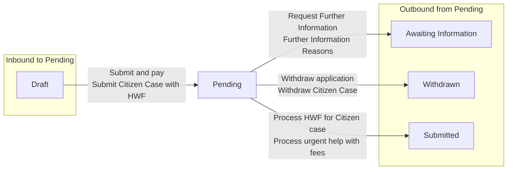

# Pending

[Back to Private Law State Model](../index.md)

State ID: `SUBMITTED_NOT_PAID`

## Local state model

## Outgoing events

| Event | End state | Runnable by |
|---|---|---|
| Withdraw application (`WithdrawApplication_Event`) | [Withdrawn](./withdrawn.md) | `[APPLICANTSOLICITOR]` `[CREATOR]` `idam:citizen` (`citizen`) |
| Withdraw Citizen Case (`citizenCaseWithdraw`) | [Withdrawn](./withdrawn.md) | `idam:citizen` (`citizen`) `idam:caseworker-privatelaw-systemupdate` (`caseworker-privatelaw-systemupdate`) |
| Process HWF for Citizen case (`hwfProcessCaseUpdate`) | [Submitted](./submitted.md) | `idam:caseworker-privatelaw-systemupdate` (`caseworker-privatelaw-systemupdate`) |
| Process urgent help with fees (`processUrgentHelpWithFees`) | [Submitted](./submitted.md) | `idam:caseworker-privatelaw-systemupdate` (`caseworker-privatelaw-systemupdate`) `hearing-centre-admin`, `allocated-admin-caseworker`, `ctsc`, `allocated-ctsc-caseworker` (`caseworker-privatelaw-courtadmin`) |
| Request Further Information (`requestFurtherInformation`) | [Awaiting Information](./awaiting-information.md) | `hearing-centre-admin`, `allocated-admin-caseworker`, `ctsc`, `allocated-ctsc-caseworker` (`caseworker-privatelaw-courtadmin`) `ctsc-team-leader` `idam:caseworker-privatelaw-superuser` (`caseworker-privatelaw-superuser`) `idam:caseworker-wa-task-configuration` (`caseworker-wa-task-configuration`) `idam:caseworker-privatelaw-systemupdate` (`caseworker-privatelaw-systemupdate`) `hearing-centre-team-leader` |
| Further Information Reasons (`requestFurtherInformationHistory`) | [Awaiting Information](./awaiting-information.md) | `hearing-centre-admin`, `allocated-admin-caseworker`, `ctsc`, `allocated-ctsc-caseworker` (`caseworker-privatelaw-courtadmin`) `ctsc-team-leader` `idam:caseworker-privatelaw-superuser` (`caseworker-privatelaw-superuser`) `idam:caseworker-wa-task-configuration` (`caseworker-wa-task-configuration`) `idam:caseworker-privatelaw-systemupdate` (`caseworker-privatelaw-systemupdate`) `hearing-centre-team-leader` |

## In-state events

| Event | End state | Runnable by |
|---|---|---|
| Send and reply to messages (`sendOrReplyToMessages`) | [Pending](./pending.md) | `hearing-centre-admin`, `allocated-admin-caseworker`, `ctsc`, `allocated-ctsc-caseworker` (`caseworker-privatelaw-courtadmin`) `caseworker-privatelaw-judge` `tribunal-caseworker`, `senior-tribunal-caseworker`, `allocated-legal-adviser` (`caseworker-privatelaw-la`) |
| Send and reply to messages (`waSendOrReplyToMessages`) | [Pending](./pending.md) | `hearing-centre-admin`, `allocated-admin-caseworker`, `ctsc`, `allocated-ctsc-caseworker` (`caseworker-privatelaw-courtadmin`) `caseworker-privatelaw-judge` `tribunal-caseworker`, `senior-tribunal-caseworker`, `allocated-legal-adviser` (`caseworker-privatelaw-la`) |

## Incoming events

| Event | Start state | Runnable by |
|---|---|---|
| Submit Citizen Case with HWF (`citizenCaseSubmitWithHWF`) | [Draft](./draft.md) | `idam:citizen` (`citizen`) `idam:caseworker-privatelaw-systemupdate` (`caseworker-privatelaw-systemupdate`) |
| Submit and pay (`submitAndPay`) | [Draft](./draft.md) | `[APPLICANTSOLICITOR]` `[CREATOR]` `idam:citizen` (`citizen`) `idam:caseworker-privatelaw-systemupdate` (`caseworker-privatelaw-systemupdate`) `hearing-centre-admin`, `allocated-admin-caseworker`, `ctsc`, `allocated-ctsc-caseworker` (`caseworker-privatelaw-courtadmin`) |
