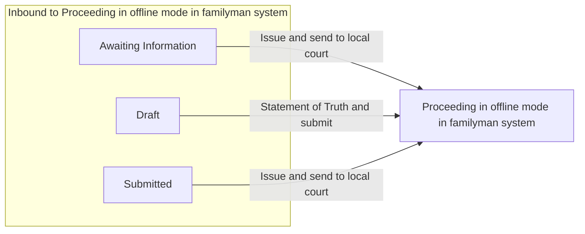

# Proceeding in offline mode in familyman system

[Back to Private Law State Model](../index.md)

State ID: `PROCEEDS_IN_HERITAGE_SYSTEM`

## Local state model

## Outgoing events

_No events found._

## In-state events

_No events found._

## Incoming events

| Event | Start state | Runnable by |
|---|---|---|
| Statement of Truth and submit (`fl401StatementOfTruthAndSubmit`) | [Draft](./draft.md) | `[APPLICANTSOLICITOR]` `[CREATOR]` `idam:citizen` (`citizen`) `hearing-centre-admin` `allocated-admin-caseworker` `ctsc` `allocated-ctsc-caseworker` (`caseworker-privatelaw-courtadmin`) `idam:caseworker-privatelaw-systemupdate` (`caseworker-privatelaw-systemupdate`) |
| Issue and send to local court (`issueAndSendToLocalCourtCallback`) | [Awaiting Information](./awaiting-information.md) | `hearing-centre-admin` `allocated-admin-caseworker` `ctsc` `allocated-ctsc-caseworker` (`caseworker-privatelaw-courtadmin`) |
| Issue and send to local court (`issueAndSendToLocalCourtCallback`) | [Submitted](./submitted.md) | `hearing-centre-admin` `allocated-admin-caseworker` `ctsc` `allocated-ctsc-caseworker` (`caseworker-privatelaw-courtadmin`) |
