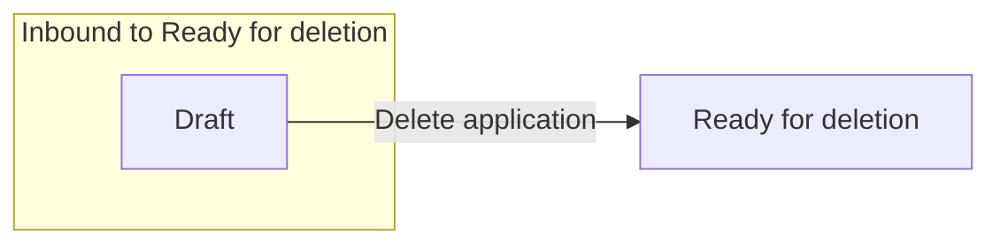

# Ready for deletion

[Back to Private Law State Model](../index.md)

State ID: `READY_FOR_DELETION`

## Local state model

## Outgoing events

_No events found._

## In-state events

_No events found._

## Incoming events

| Event | Start state | Runnable by |
|---|---|---|
| Delete application (`deleteApplication`) | [Draft](./draft.md) | `[APPLICANTSOLICITOR]` `[CREATOR]` `idam:citizen` (`citizen`) `idam:caseworker-privatelaw-systemupdate` (`caseworker-privatelaw-systemupdate`) |
