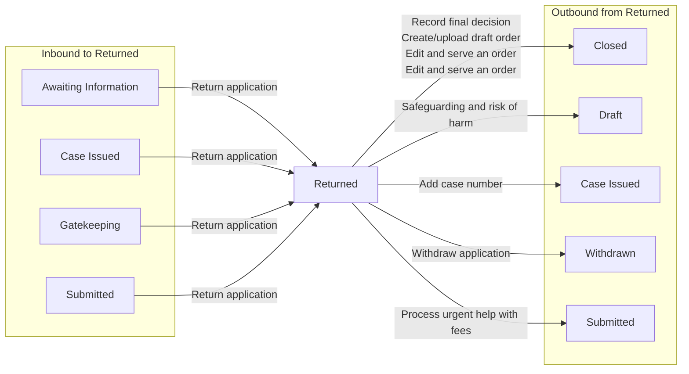

# Returned

[Back to Private Law State Model](../index.md)

State ID: `AWAITING_RESUBMISSION_TO_HMCTS`

## Local state model

## Outgoing events

| Event | End state | Runnable by |
|---|---|---|
| Withdraw application (`WithdrawApplication_Event`) | [Withdrawn](./withdrawn.md) | `[APPLICANTSOLICITOR]` `[CREATOR]` `idam:citizen` (`citizen`) |
| Edit and serve an order (`adminEditAndApproveAnOrder`) | [Closed](./closed.md) | — |
| Create/upload draft order (`draftAnOrder`) | [Closed](./closed.md) | `[C100APPLICANTBARRISTER1]` `[C100APPLICANTBARRISTER2]` `[C100APPLICANTBARRISTER3]` `[C100APPLICANTBARRISTER4]` `[C100APPLICANTBARRISTER5]` `[C100RESPONDENTBARRISTER1]` `[C100RESPONDENTBARRISTER2]` `[C100RESPONDENTBARRISTER3]` `[C100RESPONDENTBARRISTER4]` `[C100RESPONDENTBARRISTER5]` `[FL401APPLICANTBARRISTER]` `[FL401RESPONDENTBARRISTER]` |
| Add case number (`fl401AddCaseNumber`) | [Case Issued](./case-issued.md) | `hearing-centre-admin`, `allocated-admin-caseworker`, `ctsc`, `allocated-ctsc-caseworker` (`caseworker-privatelaw-courtadmin`) |
| Edit and serve an order (`hearingEditAndApproveAnOrder`) | [Closed](./closed.md) | — |
| Process urgent help with fees (`processUrgentHelpWithFees`) | [Submitted](./submitted.md) | `idam:caseworker-privatelaw-systemupdate` (`caseworker-privatelaw-systemupdate`) `hearing-centre-admin`, `allocated-admin-caseworker`, `ctsc`, `allocated-ctsc-caseworker` (`caseworker-privatelaw-courtadmin`) |
| Record final decision (`recordFinalDecision`) | [Closed](./closed.md) | `idam:caseworker-privatelaw-systemupdate` (`caseworker-privatelaw-systemupdate`) `hearing-centre-admin`, `allocated-admin-caseworker`, `ctsc`, `allocated-ctsc-caseworker` (`caseworker-privatelaw-courtadmin`) |
| Safeguarding and risk of harm (`safeguardingAndRiskOfHarm`) | [Draft](./draft.md) | — |

## In-state events

| Event | End state | Runnable by |
|---|---|---|
| Add local authority (`adminAddLocalAuthority`) | [Returned](./returned.md) | `hearing-centre-admin`, `allocated-admin-caseworker`, `ctsc`, `allocated-ctsc-caseworker` (`caseworker-privatelaw-courtadmin`) `idam:caseworker-privatelaw-superuser` (`caseworker-privatelaw-superuser`) |
| Remove barrister (`adminRemoveBarrister`) | [Returned](./returned.md) | `hearing-centre-admin`, `allocated-admin-caseworker`, `ctsc`, `allocated-ctsc-caseworker` (`caseworker-privatelaw-courtadmin`) `idam:caseworker-privatelaw-superuser` (`caseworker-privatelaw-superuser`) |
| Remove legal representative (`adminRemoveLegalRepresentativeC100`) | [Returned](./returned.md) | `hearing-centre-admin`, `allocated-admin-caseworker`, `ctsc`, `allocated-ctsc-caseworker` (`caseworker-privatelaw-courtadmin`) `idam:caseworker-privatelaw-systemupdate` (`caseworker-privatelaw-systemupdate`) |
| Remove legal representative (`adminRemoveLegalRepresentativeFL401`) | [Returned](./returned.md) | `hearing-centre-admin`, `allocated-admin-caseworker`, `ctsc`, `allocated-ctsc-caseworker` (`caseworker-privatelaw-courtadmin`) `idam:caseworker-privatelaw-systemupdate` (`caseworker-privatelaw-systemupdate`) |
| Remove local authority (`adminRemoveLocalAuthority`) | [Returned](./returned.md) | `hearing-centre-admin`, `allocated-admin-caseworker`, `ctsc`, `allocated-ctsc-caseworker` (`caseworker-privatelaw-courtadmin`) `idam:caseworker-privatelaw-superuser` (`caseworker-privatelaw-superuser`) |
| Allegations of harm (`allegationsOfHarm`) | [Returned](./returned.md) | `[APPLICANTSOLICITOR]` `[CREATOR]` `idam:citizen` (`citizen`) `idam:caseworker-privatelaw-systemupdate` (`caseworker-privatelaw-systemupdate`) |
| Allegations of harm (`allegationsOfHarmRevised`) | [Returned](./returned.md) | — |
| Amend court details (`amendCourtDetails`) | [Returned](./returned.md) | `hearing-centre-admin`, `allocated-admin-caseworker`, `ctsc`, `allocated-ctsc-caseworker` (`caseworker-privatelaw-courtadmin`) |
| Applicant details (`applicantsDetails`) | [Returned](./returned.md) | `[APPLICANTSOLICITOR]` `[CREATOR]` `idam:citizen` (`citizen`) `idam:caseworker-privatelaw-systemupdate` (`caseworker-privatelaw-systemupdate`) |
| Attach scanned docs (`attachScannedDocs`) | [Returned](./returned.md) | `caseworker-privatelaw-bulkscansystemupdate` `idam:caseworker-privatelaw-systemupdate` (`caseworker-privatelaw-systemupdate`) `caseworker-privatelaw-bulkscan` `hearing-centre-admin`, `allocated-admin-caseworker`, `ctsc`, `allocated-ctsc-caseworker` (`caseworker-privatelaw-courtadmin`) |
| Attending the hearing (`attendingTheHearing`) | [Returned](./returned.md) | `[APPLICANTSOLICITOR]` `[CREATOR]` `idam:citizen` (`citizen`) `idam:caseworker-privatelaw-systemupdate` (`caseworker-privatelaw-systemupdate`) |
| Stop representing client (`barristerStopRepresenting`) | [Returned](./returned.md) | `[C100APPLICANTBARRISTER1]` `[C100APPLICANTBARRISTER2]` `[C100APPLICANTBARRISTER3]` `[C100APPLICANTBARRISTER4]` `[C100APPLICANTBARRISTER5]` `[C100RESPONDENTBARRISTER1]` `[C100RESPONDENTBARRISTER2]` `[C100RESPONDENTBARRISTER3]` `[C100RESPONDENTBARRISTER4]` `[C100RESPONDENTBARRISTER5]` `[FL401APPLICANTBARRISTER]` `[FL401RESPONDENTBARRISTER]` |
| Add case number (`caseNumber`) | [Returned](./returned.md) | `hearing-centre-admin`, `allocated-admin-caseworker`, `ctsc`, `allocated-ctsc-caseworker` (`caseworker-privatelaw-courtadmin`) |
| Child details (`childDetails`) | [Returned](./returned.md) | `[APPLICANTSOLICITOR]` `[CREATOR]` `idam:citizen` (`citizen`) `idam:caseworker-privatelaw-systemupdate` (`caseworker-privatelaw-systemupdate`) |
| Child details (`childDetailsRevised`) | [Returned](./returned.md) | `[APPLICANTSOLICITOR]` `[CREATOR]` `idam:citizen` (`citizen`) `idam:caseworker-privatelaw-systemupdate` (`caseworker-privatelaw-systemupdate`) |
| Children and applicants (`childrenAndApplicants`) | [Returned](./returned.md) | `[APPLICANTSOLICITOR]` `[CREATOR]` `idam:citizen` (`citizen`) `idam:caseworker-privatelaw-systemupdate` (`caseworker-privatelaw-systemupdate`) |
| Children and other people (`childrenAndOtherPeople`) | [Returned](./returned.md) | `[APPLICANTSOLICITOR]` `[CREATOR]` `idam:citizen` (`citizen`) `idam:caseworker-privatelaw-systemupdate` (`caseworker-privatelaw-systemupdate`) |
| Children and respondents (`childrenAndRespondents`) | [Returned](./returned.md) | `[APPLICANTSOLICITOR]` `[CREATOR]` `idam:citizen` (`citizen`) `idam:caseworker-privatelaw-systemupdate` (`caseworker-privatelaw-systemupdate`) |
| Applicant’s family (`fl401ApplicantFamilyDetails`) | [Returned](./returned.md) | `[APPLICANTSOLICITOR]` `[CREATOR]` `idam:citizen` (`citizen`) `idam:caseworker-privatelaw-systemupdate` (`caseworker-privatelaw-systemupdate`) |
| The home (`fl401Home`) | [Returned](./returned.md) | `[APPLICANTSOLICITOR]` `[CREATOR]` `idam:citizen` (`citizen`) `idam:caseworker-privatelaw-systemupdate` (`caseworker-privatelaw-systemupdate`) |
| Other proceedings (`fl401OtherProceedings`) | [Returned](./returned.md) | `[APPLICANTSOLICITOR]` `[CREATOR]` `idam:citizen` (`citizen`) `idam:caseworker-privatelaw-systemupdate` (`caseworker-privatelaw-systemupdate`) |
| Type of application (`fl401TypeOfApplication`) | [Returned](./returned.md) | `[APPLICANTSOLICITOR]` `[CREATOR]` `idam:citizen` (`citizen`) `idam:caseworker-privatelaw-systemupdate` (`caseworker-privatelaw-systemupdate`) |
| Upload documents (`fl401UploadDocuments`) | [Returned](./returned.md) | `[APPLICANTSOLICITOR]` `[CREATOR]` `idam:citizen` (`citizen`) `idam:caseworker-privatelaw-systemupdate` (`caseworker-privatelaw-systemupdate`) |
| Statement of Truth and submit (`fl401resubmit`) | [Returned](./returned.md) | `[APPLICANTSOLICITOR]` `[CREATOR]` `idam:citizen` (`citizen`) `idam:caseworker-privatelaw-systemupdate` (`caseworker-privatelaw-systemupdate`) |
| Hearing urgency (`hearingUrgency`) | [Returned](./returned.md) | `[APPLICANTSOLICITOR]` `[CREATOR]` `idam:citizen` (`citizen`) `idam:caseworker-privatelaw-systemupdate` (`caseworker-privatelaw-systemupdate`) |
| International element (`internationalElement`) | [Returned](./returned.md) | `[APPLICANTSOLICITOR]` `[CREATOR]` `idam:citizen` (`citizen`) `idam:caseworker-privatelaw-systemupdate` (`caseworker-privatelaw-systemupdate`) |
| Litigation capacity (`litigationCapacity`) | [Returned](./returned.md) | `[APPLICANTSOLICITOR]` `[CREATOR]` `idam:citizen` (`citizen`) `idam:caseworker-privatelaw-systemupdate` (`caseworker-privatelaw-systemupdate`) |
| Manage documents (`manageDocuments`) | [Returned](./returned.md) | — |
| Manage documents (`manageDocumentsNew`) | [Returned](./returned.md) | `idam:caseworker-privatelaw-solicitor` (`caseworker-privatelaw-solicitor`) `idam:citizen` (`citizen`) `hearing-centre-admin`, `allocated-admin-caseworker`, `ctsc`, `allocated-ctsc-caseworker` (`caseworker-privatelaw-courtadmin`) `caseworker-privatelaw-judge` `tribunal-caseworker`, `senior-tribunal-caseworker`, `allocated-legal-adviser` (`caseworker-privatelaw-la`) `idam:caseworker-privatelaw-systemupdate` (`caseworker-privatelaw-systemupdate`) `listed-hearing-viewer`, `caseworker-privatelaw-externaluser-viewonly` (`caseworker-privatelaw-externaluser-viewonly`) `[C100APPLICANTBARRISTER1]` `[C100APPLICANTBARRISTER2]` `[C100APPLICANTBARRISTER3]` `[C100APPLICANTBARRISTER4]` `[C100APPLICANTBARRISTER5]` `[C100RESPONDENTBARRISTER1]` `[C100RESPONDENTBARRISTER2]` `[C100RESPONDENTBARRISTER3]` `[C100RESPONDENTBARRISTER4]` `[C100RESPONDENTBARRISTER5]` `[FL401APPLICANTBARRISTER]` `[FL401RESPONDENTBARRISTER]` `[LASOCIALWORKER]` `[LASOLICITOR]` |
| MIAM (`miam`) | [Returned](./returned.md) | `[APPLICANTSOLICITOR]` `[CREATOR]` `idam:citizen` (`citizen`) `idam:caseworker-privatelaw-systemupdate` (`caseworker-privatelaw-systemupdate`) |
| MIAM (`miamPolicyUpgrade`) | [Returned](./returned.md) | `[CREATOR]` `[APPLICANTSOLICITOR]` `idam:citizen` (`citizen`) `idam:caseworker-privatelaw-systemupdate` (`caseworker-privatelaw-systemupdate`) |
| Other children not in the case (`otherChildNotInTheCase`) | [Returned](./returned.md) | `[APPLICANTSOLICITOR]` `[CREATOR]` `idam:citizen` (`citizen`) `idam:caseworker-privatelaw-systemupdate` (`caseworker-privatelaw-systemupdate`) |
| Other people in the case (`otherPeopleInTheCase`) | [Returned](./returned.md) | `[APPLICANTSOLICITOR]` `[CREATOR]` `idam:citizen` (`citizen`) `idam:caseworker-privatelaw-systemupdate` (`caseworker-privatelaw-systemupdate`) |
| Other people in the case (`otherPeopleInTheCaseRevised`) | [Returned](./returned.md) | `[APPLICANTSOLICITOR]` `[CREATOR]` `idam:citizen` (`citizen`) `idam:caseworker-privatelaw-systemupdate` (`caseworker-privatelaw-systemupdate`) |
| Other proceedings (`otherProceedings`) | [Returned](./returned.md) | `[APPLICANTSOLICITOR]` `[CREATOR]` `idam:citizen` (`citizen`) `idam:caseworker-privatelaw-systemupdate` (`caseworker-privatelaw-systemupdate`) |
| Respondent's behaviour (`respondentBehaviour`) | [Returned](./returned.md) | `[APPLICANTSOLICITOR]` `[CREATOR]` `idam:citizen` (`citizen`) `idam:caseworker-privatelaw-systemupdate` (`caseworker-privatelaw-systemupdate`) |
| Relationship to respondent (`respondentRelationship`) | [Returned](./returned.md) | `[APPLICANTSOLICITOR]` `[CREATOR]` `idam:citizen` (`citizen`) `idam:caseworker-privatelaw-systemupdate` (`caseworker-privatelaw-systemupdate`) |
| Respondent details (`respondentsDetails`) | [Returned](./returned.md) | `[APPLICANTSOLICITOR]` `[CREATOR]` `idam:citizen` (`citizen`) `idam:caseworker-privatelaw-systemupdate` (`caseworker-privatelaw-systemupdate`) |
| Review Additional Application (`reviewAdditionalApplication`) | [Returned](./returned.md) | `hearing-centre-admin`, `allocated-admin-caseworker`, `ctsc`, `allocated-ctsc-caseworker` (`caseworker-privatelaw-courtadmin`) `caseworker-privatelaw-judge` `tribunal-caseworker`, `senior-tribunal-caseworker`, `allocated-legal-adviser` (`caseworker-privatelaw-la`) `idam:caseworker-privatelaw-systemupdate` (`caseworker-privatelaw-systemupdate`) `idam:caseworker-privatelaw-superuser` (`caseworker-privatelaw-superuser`) |
| Review documents (`reviewDocuments`) | [Returned](./returned.md) | `hearing-centre-admin`, `allocated-admin-caseworker`, `ctsc`, `allocated-ctsc-caseworker` (`caseworker-privatelaw-courtadmin`) `idam:caseworker-privatelaw-systemupdate` (`caseworker-privatelaw-systemupdate`) |
| Type of application (`selectApplicationType`) | [Returned](./returned.md) | `[APPLICANTSOLICITOR]` `[CREATOR]` `idam:citizen` (`citizen`) `idam:caseworker-privatelaw-systemupdate` (`caseworker-privatelaw-systemupdate`) |
| Send and reply to messages (`sendOrReplyToMessages`) | [Returned](./returned.md) | `hearing-centre-admin`, `allocated-admin-caseworker`, `ctsc`, `allocated-ctsc-caseworker` (`caseworker-privatelaw-courtadmin`) `caseworker-privatelaw-judge` `tribunal-caseworker`, `senior-tribunal-caseworker`, `allocated-legal-adviser` (`caseworker-privatelaw-la`) |
| Remove barrister (`solicitorRemoveBarrister`) | [Returned](./returned.md) | `[C100RESPONDENTSOLICITOR1]` `[C100RESPONDENTSOLICITOR2]` `[C100RESPONDENTSOLICITOR3]` `[C100RESPONDENTSOLICITOR4]` `[C100RESPONDENTSOLICITOR5]` `[C100APPLICANTSOLICITOR1]` `[C100APPLICANTSOLICITOR2]` `[C100APPLICANTSOLICITOR3]` `[C100APPLICANTSOLICITOR4]` `[C100APPLICANTSOLICITOR5]` `[FL401RESPONDENTSOLICITOR]` `[FL401APPLICANTSOLICITOR]` `[APPLICANTSOLICITOR]` |
| Stop representing client (`solicitorStopRepresentingLiP`) | [Returned](./returned.md) | `[APPLICANTSOLICITOR]` `[CREATOR]` `[C100APPLICANTSOLICITOR1]` `[C100APPLICANTSOLICITOR2]` `[C100APPLICANTSOLICITOR3]` `[C100APPLICANTSOLICITOR4]` `[C100APPLICANTSOLICITOR5]` `[C100RESPONDENTSOLICITOR1]` `[C100RESPONDENTSOLICITOR2]` `[C100RESPONDENTSOLICITOR3]` `[C100RESPONDENTSOLICITOR4]` `[C100RESPONDENTSOLICITOR5]` `[FL401APPLICANTSOLICITOR]` `[FL401RESPONDENTSOLICITOR]` `idam:caseworker-privatelaw-systemupdate` (`caseworker-privatelaw-systemupdate`) |
| Submit (`submit`) | [Returned](./returned.md) | `[APPLICANTSOLICITOR]` `[CREATOR]` `idam:citizen` (`citizen`) `idam:caseworker-privatelaw-systemupdate` (`caseworker-privatelaw-systemupdate`) |
| Upload additional applications (`uploadAdditionalApplications`) | [Returned](./returned.md) | `[APPLICANTSOLICITOR]` `[C100APPLICANTSOLICITOR1]` `[C100APPLICANTSOLICITOR2]` `[C100APPLICANTSOLICITOR3]` `[C100APPLICANTSOLICITOR4]` `[C100APPLICANTSOLICITOR5]` `[C100RESPONDENTSOLICITOR1]` `[C100RESPONDENTSOLICITOR2]` `[C100RESPONDENTSOLICITOR3]` `[C100RESPONDENTSOLICITOR4]` `[C100RESPONDENTSOLICITOR5]` `[FL401APPLICANTSOLICITOR]` `[FL401RESPONDENTSOLICITOR]` `idam:caseworker-privatelaw-systemupdate` (`caseworker-privatelaw-systemupdate`) |
| Upload documents (`uploadDocuments`) | [Returned](./returned.md) | — |
| View PDF application (`viewPdfDocument`) | [Returned](./returned.md) | `[APPLICANTSOLICITOR]` `[CREATOR]` `idam:citizen` (`citizen`) `idam:caseworker-privatelaw-systemupdate` (`caseworker-privatelaw-systemupdate`) |
| Send and reply to messages (`waSendOrReplyToMessages`) | [Returned](./returned.md) | `hearing-centre-admin`, `allocated-admin-caseworker`, `ctsc`, `allocated-ctsc-caseworker` (`caseworker-privatelaw-courtadmin`) `caseworker-privatelaw-judge` `tribunal-caseworker`, `senior-tribunal-caseworker`, `allocated-legal-adviser` (`caseworker-privatelaw-la`) |
| Welsh language requirements (`welshLanguageRequirements`) | [Returned](./returned.md) | `[APPLICANTSOLICITOR]` `[CREATOR]` `idam:citizen` (`citizen`) `idam:caseworker-privatelaw-systemupdate` (`caseworker-privatelaw-systemupdate`) |
| Without notice order (`withoutNoticeOrderDetails`) | [Returned](./returned.md) | `[APPLICANTSOLICITOR]` `[CREATOR]` `idam:citizen` (`citizen`) `idam:caseworker-privatelaw-systemupdate` (`caseworker-privatelaw-systemupdate`) |

## Incoming events

| Event | Start state | Runnable by |
|---|---|---|
| Return application (`returnApplication`) | [Awaiting Information](./awaiting-information.md) | `hearing-centre-admin`, `allocated-admin-caseworker`, `ctsc`, `allocated-ctsc-caseworker` (`caseworker-privatelaw-courtadmin`) |
| Return application (`returnApplication`) | [Case Issued](./case-issued.md) | `hearing-centre-admin`, `allocated-admin-caseworker`, `ctsc`, `allocated-ctsc-caseworker` (`caseworker-privatelaw-courtadmin`) |
| Return application (`returnApplication`) | [Gatekeeping](./gatekeeping.md) | `hearing-centre-admin`, `allocated-admin-caseworker`, `ctsc`, `allocated-ctsc-caseworker` (`caseworker-privatelaw-courtadmin`) |
| Return application (`returnApplication`) | [Submitted](./submitted.md) | `hearing-centre-admin`, `allocated-admin-caseworker`, `ctsc`, `allocated-ctsc-caseworker` (`caseworker-privatelaw-courtadmin`) |
